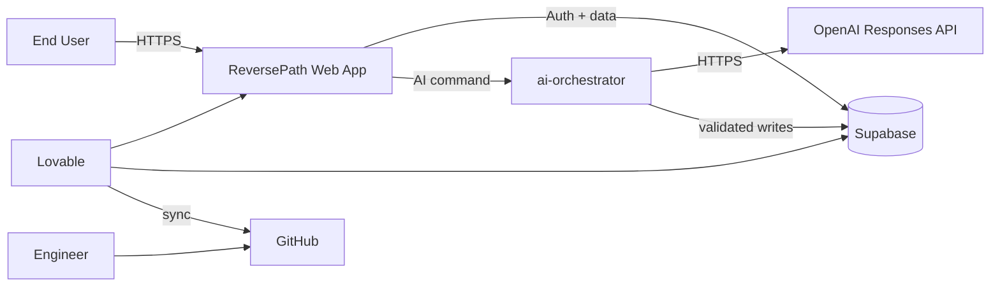
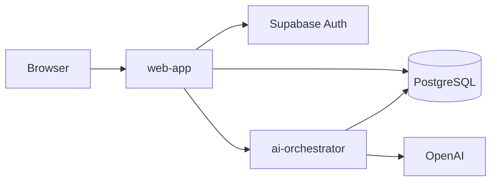
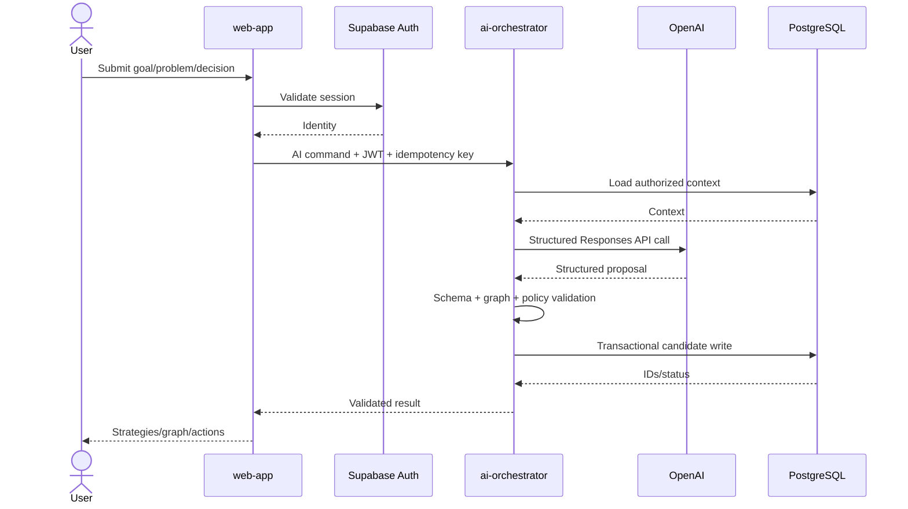
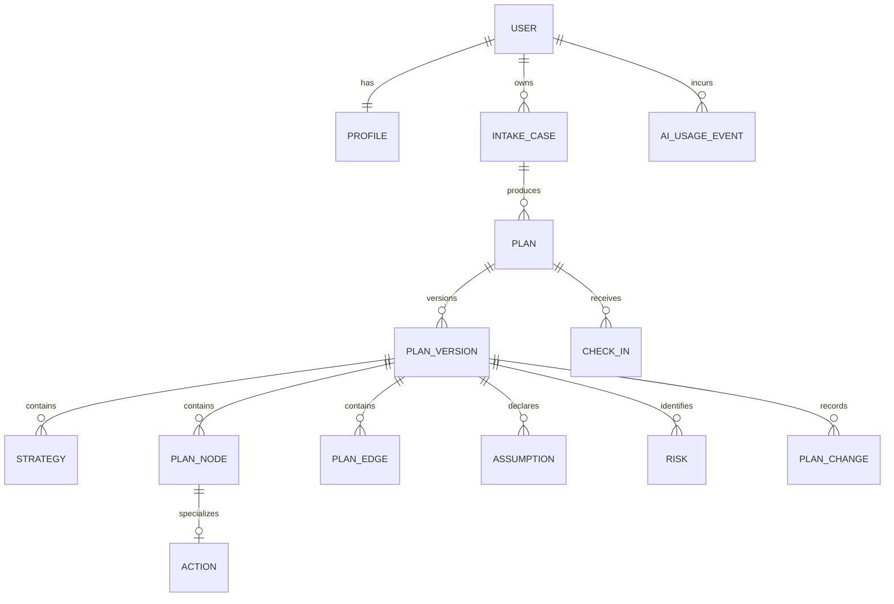
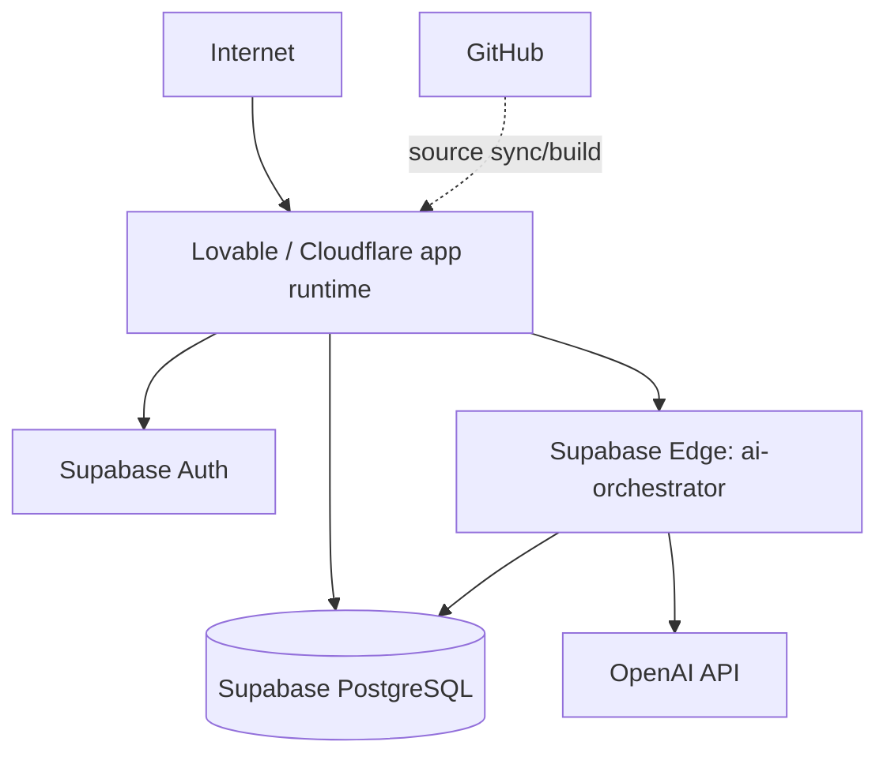
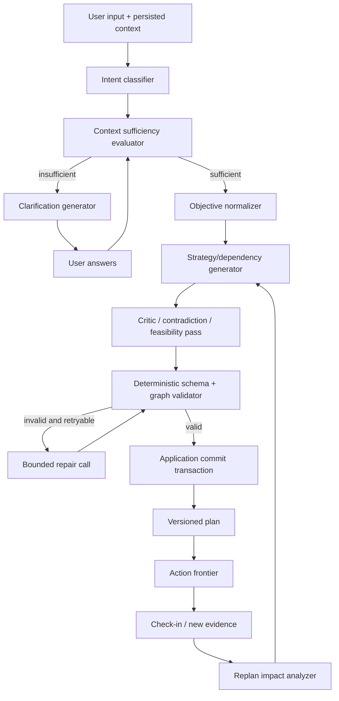
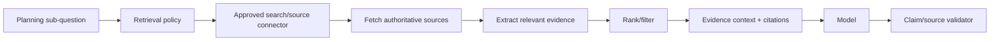
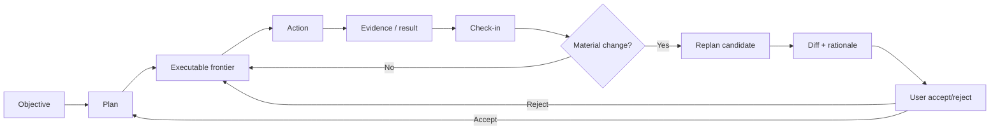

# Deep Technical Architecture & Engineering Documentation

**Document type:** Master Technical Architecture / Engineering Design Document  
**Documentation model:** Docs-as-Code  
**Recommended filename:** `DEEP_TECHNICAL_ARCHITECTURE.md`  
**Status:** Implementation baseline in progress  
**System:** ReversePath (working name)  
**Project:** ReversePath MVP  
**Document version:** 0.1.0  
**System version:** 0.1.0 MVP baseline  
**Last updated:** 2026-09-01  
**Primary owner:** TBD  
**Technical owner:** TBD  
**Security owner:** TBD  
**Operations owner:** TBD

> [DECISION] `ReversePath` is a provisional technical codename. Rename it before implementation if desired; component and data contracts remain unchanged.
>
> [REQUIRED] No production system exists yet. All component, API, data, SLO, security, deployment, and operations sections below define the **target MVP architecture**. Claims requiring evidence are explicitly marked TBD rather than fabricated. After Lovable generates the codebase, this document MUST be reconciled against the actual repository, migrations, configuration, tests, deployment, and monitoring.

---

## Implementation Reconciliation Note

As of 2026-09-01 this repository contains a TanStack Start/React/TypeScript implementation with Supabase migrations, server-side AI orchestration, structured AI schemas, authenticated server functions, plan graph persistence, executable-frontier logic, action/check-in/replan flows, and automated Vitest coverage for core domain and schema behavior.

This note updates the original pre-implementation baseline without replacing the deeper target architecture. The implementation is authoritative where it differs from the draft sections below.

Current evidence locations:

- Application routes: `src/routes/`
- Domain model and executable frontier: `src/domain/`
- AI contracts and orchestrator: `src/ai/`
- Server functions: `src/lib/*.functions.ts`
- Supabase schema/RLS/ownership migrations: `supabase/migrations/`
- Automated tests: `tests/`
- Local setup and environment contract: `README.md` and `.env.example`

Known implementation deviations from the original target:

- AI execution currently runs through TanStack server functions using an OpenAI-compatible provider boundary. A separate Supabase Edge Function is not yet present.
- The provider is OpenAI by default via server-side `OPENAI_API_KEY`; Lovable AI remains an optional compatible fallback for Lovable-hosted environments.
- Full browser E2E and live Supabase RLS integration tests require external project credentials and are not yet committed.

---

## How to Use This Document

This is the authoritative pre-implementation architecture and Lovable build contract for ReversePath. The product is a general-purpose AI planning and execution system that accepts a user's desire, goal, problem, decision, doubt, project, habit, learning objective, or other daily-life objective; understands the requested outcome; models current state, constraints, and resources; reverse-engineers prerequisites; generates alternative strategies; evaluates feasibility, assumptions, and risks; converts the selected path into milestones and concrete next actions; tracks execution; and replans when circumstances change.

The design deliberately separates **AI reasoning proposals** from **authoritative product state**. AI output is untrusted until it passes JSON-schema, graph-integrity, ownership, and policy validation. The database, not a chat transcript, is the system of record.

### Documentation Markers

| Marker | Meaning |
|---|---|
| `[REQUIRED]` | Expected for production implementation |
| `[CONDITIONAL]` | Include when applicable |
| `[EVIDENCE]` | Requires measurable/verifiable evidence |
| `[OWNER]` | Requires accountable person/team |
| `[DECISION]` | Architecture decision/trade-off |
| `[RISK]` | Technical/business/security risk |
| `[TBD]` | Genuinely not yet known |
| `[N/A]` | Deliberately not applicable |

---

# 0. Document Governance

## 0.1 Document Identity [REQUIRED]

| Field | Value |
|---|---|
| Document ID | DOC-RP-ARCH-001 |
| Project | ReversePath MVP |
| System | ReversePath |
| Repository | TBD — GitHub repository will be created/synced from Lovable |
| Document version | 0.1.0 |
| System version | 0.0.0 — not implemented |
| Status | Draft |
| Classification | INTERNAL during development; revisit before public release |
| Created | 2026-08-27 |
| Updated | 2026-08-27 |

## 0.2 Document Purpose [REQUIRED]

This document defines why ReversePath exists, what it owns, what it excludes, how its AI and deterministic components interact, how data is represented and secured, how the system fails and recovers, how it is deployed and observed, and how implementation decisions are verified.

It must let an engineer answer:

- What does ReversePath do?
- What is inside/outside the system boundary?
- How are desires/problems/decisions turned into structured plans?
- Which operations are AI-generated and which are deterministic?
- How are plans versioned, audited, and replanned?
- How are user data and AI-provider credentials protected?
- How does the application map to Lovable, Supabase, OpenAI, GitHub, and production operations?

## 0.3 Intended Audience [REQUIRED]

| Audience | Why They Need This Document |
|---|---|
| Product engineering | Product capability boundaries and build sequence |
| Software engineers | Implementation and maintenance |
| Architects | Architecture evolution/trade-offs |
| DevOps/platform | Infrastructure, secrets, CI/CD |
| SRE/operations | Reliability, incidents, recovery |
| Security | Threat model, RLS, auth, AI abuse controls |
| QA | Acceptance criteria, regression, AI evals |
| Data/analytics | Data contracts, lineage, retention |
| Support | Troubleshooting/user-data operations |
| Lovable agent | Primary implementation specification |

## 0.4 Ownership [OWNER]

| Area | Owner |
|---|---|
| Product | TBD |
| Architecture | TBD |
| Backend | TBD |
| Frontend | TBD |
| Mobile | N/A — responsive web/PWA only for MVP |
| Infrastructure | TBD |
| Database | TBD |
| Security | TBD |
| Operations | TBD |
| Documentation | TBD |

## 0.5 Review and Approval

| Role | Name/Team | Status | Date |
|---|---|---|---|
| Author | AI-assisted draft; human owner TBD | Draft | 2026-08-27 |
| Architecture reviewer | TBD | Pending | TBD |
| Security reviewer | TBD | Pending | TBD |
| Operations reviewer | TBD | Pending | TBD |
| Approver | TBD | Pending | TBD |

## 0.6 Revision History

| Version | Date | Author | Description |
|---|---|---|---|
| 0.1.0 | 2026-08-27 | Draft | Consolidated concept + target technical architecture |

---

# 1. Executive Technical Overview

## 1.1 System Summary [REQUIRED]

ReversePath is a general-purpose AI decision-and-execution web application. It is intentionally not restricted to finance, housing, career, business, productivity, or education. A user may submit a desire ("I want a house"), goal ("I want ₹1 crore net worth"), problem ("revenue fell 40%"), decision ("should I quit my job?"), uncertainty ("which career suits me?"), project, learning objective, habit objective, or another meaningful objective.

The system first identifies the **reasoning mode**. A desire is clarified into an outcome; a problem is decomposed into symptoms/causes/controllable variables; a decision compares options, criteria, reversibility, and risk; a learning objective becomes a prerequisite/skill tree; a project becomes deliverables, dependencies, critical path, milestones, and tasks. This avoids applying one generic roadmap to every situation.

The core domain model is a **versioned directed graph**. Nodes represent objectives, outcomes, requirements, resources, constraints, gaps, strategies, milestones, actions, experiments, assumptions, risks, evidence, blockers, and metrics. Edges represent relations such as `REQUIRES`, `BLOCKED_BY`, `ENABLES`, `SUPPORTS`, `CONFLICTS_WITH`, `VALIDATES`, `MITIGATES`, and `DERIVED_FROM`. This supports both WHY reasoning (underlying objective) and HOW reasoning (prerequisites and actions).

AI is used for interpretation, decomposition, strategy generation, critique, explanation, and replanning. AI is **not** authoritative storage. Structured model outputs are validated before persistence. Plan state, user ownership, action completion, plan activation, version history, quotas, idempotency, and authorization are deterministic application/database responsibilities.

The MVP architecture is a modular monolith optimized for Lovable and Supabase. Current Lovable documentation states that newly created apps after May 13, 2026 use TanStack Start with React and SSR, while Supabase remains available for PostgreSQL, authentication, storage/realtime, and server-side functions. The target architecture therefore uses TanStack Start/React/Tailwind for the web application and Supabase PostgreSQL/Auth/RLS as the system of record.

Sensitive OpenAI calls execute only server-side through a protected `ai-orchestrator` boundary. No OpenAI secret may appear in browser JavaScript, localStorage, a public environment variable, or GitHub. The OpenAI Responses API is the target interface because current models support function calling and Structured Outputs. Model names remain configuration-driven rather than architecture invariants.

The primary workflow is: authenticate → submit intent → answer only necessary clarification questions → confirm normalized objective → generate reverse-engineered graph and strategy options → inspect feasibility/assumptions/risks → select path → receive milestones and minimum next actions → execute/check in → replan when facts change.

The MVP does not autonomously execute financial trades, purchases, legal filings, medical treatment, hiring/firing, or other consequential external actions. High-stakes domains may be supported only through restricted planning/organization behavior and explicit uncertainty/domain policy.

## 1.2 One-Minute Architecture

**System:** ReversePath is a multi-domain AI planning and execution application for individual users.

**Primary components:**

1. `web-app` — TanStack Start/React UI and server routes.
2. `application-core` — deterministic domain/application services.
3. `ai-orchestrator` — server-side model gateway and reasoning pipeline.
4. `postgres` — Supabase PostgreSQL system of record with RLS.
5. `supabase-auth` — identity/session.
6. `openai-api` — external inference provider through adapter interface.
7. `github-repository` — source-of-truth codebase after sync.

```text
Browser
  ↓ HTTPS
TanStack Start web app
  ↓
Application/domain layer
  ├─→ Supabase PostgreSQL
  └─→ ai-orchestrator
         ↓ server-side HTTPS
       OpenAI Responses API
         ↓ structured JSON
       schema + policy + graph validation
         ↓
       PostgreSQL plan/version writes
  ↓
Browser renders graph + actions
```

## 1.3 Architecture at a Glance

| Dimension | Target Implementation |
|---|---|
| Architecture style | Modular monolith + isolated AI gateway + relational graph |
| Primary language | TypeScript |
| Frontend | React via TanStack Start; Tailwind CSS |
| Backend | TanStack server functions/routes + Supabase Edge Function for AI |
| Database | Supabase PostgreSQL |
| Cache | N/A for MVP |
| Messaging | N/A for MVP; add only if async workloads require it |
| Platform | Lovable + Supabase; GitHub portable |
| Deployment | Lovable publish first; independent Git-based hosting later possible |
| Authentication | Supabase Auth |
| Authorization | PostgreSQL RLS + server ownership checks |
| CI/CD | Lovable publish initially; GitHub Actions target |
| Observability | Structured logs + AI usage metrics; exact APM TBD |

---

# 2. Problem, Goals, Scope, and Constraints

## 2.1 Problem Statement [REQUIRED]

People often know what they want but cannot translate the desire into a reliable execution path. Generic AI can generate advice, but typically does not persist a dependency graph, explicit assumptions, alternative strategies, feasibility, bottlenecks, minimum next actions, plan history, or systematic replanning.

```text
"I want X"
  ↓
What exactly does X mean?
  ↓
What must become true for X?
  ↓
What must become true before each prerequisite?
  ↓
What is missing from the user's current state?
  ↓
Which path fits the user's constraints/resources?
  ↓
What can the user actually do next?
```

### Why It Matters

- Vague objectives cannot be measured or planned reliably.
- Users spend effort on low-leverage work because bottlenecks are hidden.
- Static roadmaps become stale as reality changes.
- A single AI strategy can hide safer/faster alternatives.
- AI often mixes facts, assumptions, estimates, and recommendations.
- Real execution is limited by time, money, skills, energy, network, assets, location, health capacity, and responsibilities.

## 2.2 Business Goals

| ID | Goal | Success Metric | Owner |
|---|---|---|---|
| BG-001 | Convert vague intent into executable action | ≥70% activated users reach an accepted next action in first session; validate in beta | TBD |
| BG-002 | Create repeat execution behavior | ≥30% week-4 retained activated users; validate | TBD |
| BG-003 | Make plans transparent | 100% plans expose assumptions/confidence/strategy rationale | TBD |
| BG-004 | Support multiple domains | MVP supports goal, desire, problem, decision, uncertainty, learning, project, habit | TBD |
| BG-005 | Preserve user agency | No consequential external action without explicit user action/authorization | TBD |

## 2.3 Technical Goals

| ID | Goal | Measurement |
|---|---|---|
| TG-001 | Deterministic state | 100% plan mutations represented by DB state/version records |
| TG-002 | Structured AI outputs | ≥99% accepted AI outputs schema-valid after bounded repair; evidence pending |
| TG-003 | Secret protection | 0 provider secret values in client bundle/repository scans |
| TG-004 | User isolation | RLS tests prove user A cannot read/write user B records |
| TG-005 | Non-AI latency | P95 target <500 ms; validate after implementation |
| TG-006 | Standard plan generation | P95 target <20 s; async redesign if unattainable |
| TG-007 | Recoverability | MVP target RPO ≤24 h, RTO ≤4 h; validate against selected plan |
| TG-008 | AI cost containment | Enforce per-user/global quotas, token budgets, model routing |

## 2.4 Non-Goals [REQUIRED]

- Autonomous execution of trades, purchases, medical treatment, legal filings, hiring/firing, or other consequential actions.
- Guaranteed outcomes or predictions represented as certainty.
- Replacing licensed medical/legal/financial/mental-health professionals.
- Native iOS/Android apps in MVP.
- Training a proprietary foundation model.
- Unrestricted multi-agent swarms.
- General web-crawling/RAG platform in MVP.
- Enterprise org tenancy/RBAC in MVP.

## 2.5 In Scope

- Authentication/private workspace.
- Optional rate-limited guest/demo flow.
- Intent classification and clarification.
- Objective normalization.
- WHY and HOW/dependency trees.
- Resource/constraint/gap model.
- Strategy alternatives/comparison.
- Feasibility/confidence/assumptions/risks.
- Premortem/failure analysis.
- Bottleneck detection.
- Milestones and concrete next actions.
- Action tracking/check-ins.
- Immutable plan versioning/replanning.
- What-changed view.
- Inter-goal conflict/synergy detection at basic level.
- Data export/delete.
- Server-side OpenAI integration.
- GitHub sync/deployment path.

## 2.6 Out of Scope

- Automatic external execution through banks, brokers, healthcare, employers, government.
- Unsupervised tool-using agents with unrestricted network access.
- User community/social network.
- Human-coach marketplace.
- Voice-first UX.
- Offline-native apps.
- Enterprise SSO/RBAC.
- Dedicated graph database/vector database without measured need.

## 2.7 Assumptions

| ID | Assumption | Impact if False | Owner | Status |
|---|---|---|---|---|
| ASM-001 | Lovable can generate/maintain TanStack/Supabase target | Manual scaffold needed | TBD | Open |
| ASM-002 | Supabase Auth + RLS satisfy initial isolation | Auth/data redesign | TBD | Open |
| ASM-003 | Structured Outputs reliably fit plan schema | Add repair/provider alternative | TBD | Open |
| ASM-004 | Initial AI workflow can be synchronous | Add durable job/worker | TBD | Open |
| ASM-005 | Users accept relevant clarification questions | UX must infer/default more | TBD | Open |
| ASM-006 | Domain-agnostic core + domain policies is viable | Add specialist planners | TBD | Open |

## 2.8 Constraints

**Technical:** Lovable/Supabase compatible; AI structured outputs only; RLS at database layer; secrets server-side.  
**Business:** minimize fixed infrastructure; bound AI cost.  
**Organizational:** engineering team TBD.  
**Regulatory:** privacy/high-stakes obligations depend launch geography; review TBD.  
**Legacy:** N/A.  
**Financial:** OpenAI API usage cannot be assumed permanently free. API billing is separate from ChatGPT; complimentary usage is conditional/account-dependent.

---

# 3. Stakeholders and Architecture Drivers

## 3.1 Stakeholder Register

| Stakeholder | Concerns | Decisions Influenced |
|---|---|---|
| Product | General usefulness, retention | Scope, workflows, pricing |
| Users | Trust, privacy, manageable actions | UX, explanations, controls |
| Engineering | Maintainability, cost, correctness | Architecture, schemas, tests |
| Security | Isolation, secrets, abuse | RLS, auth, logging, gateway |
| Operations | Diagnosis/recovery | Observability, runbooks |
| AI quality | Hallucination, plan quality | Model routing, evals, schemas |

## 3.2 Architecture Drivers [REQUIRED]

**Functional:** multi-intent reasoning; persistent graph; multiple strategies; resource/constraint model; deterministic action state; versioned replanning.  
**Quality:** security/privacy; AI validity; maintainability; cost; latency; recoverability; extensibility; accessibility.  
**Business:** rapid Lovable MVP, GitHub ownership, avoid premature complexity.  
**Regulatory:** privacy and high-stakes-domain restrictions.

## 3.3 Architecture Principles

### AP-001 — Structured State Over Chat Transcript
Durable product state MUST live in explicit entities, not only conversation history.

### AP-002 — AI Proposes; Deterministic Code Commits
Model output is untrusted until schema, graph, ownership, and policy validation pass.

### AP-003 — Least Information Needed
Ask/store/send only information materially needed for the current reasoning task.

### AP-004 — Explicit Uncertainty
Keep `FACT_USER`, `FACT_EXTERNAL`, `ESTIMATE`, `ASSUMPTION`, `HYPOTHESIS`, and `RECOMMENDATION` distinct.

### AP-005 — Minimum Next Action
A plan is incomplete if it has neither a concrete executable action nor an explicit blocker.

### AP-006 — No Premature Distributed Architecture
Use modular monolith + one AI gateway until measured requirements justify more.

### AP-007 — Server-Side Secrets
No private key may appear in client bundle, browser storage, source control, or public env variables.

### AP-008 — Version Every Material Replan
Material changes create a new plan version; history remains auditable until deletion/retention applies.

### AP-009 — User Is Final Decision Maker
System recommends and explains; user approves material strategy changes and executes external actions.

### AP-010 — Provider/Platform Portability
AI provider behind adapter; core domain must not depend directly on Lovable/OpenAI/Supabase SDKs.

---

# 4. Requirements Baseline

## 4.1 Functional Requirements

| ID | Requirement | Priority | Acceptance Criteria |
|---|---|---:|---|
| FR-001 | Authentication | High | Signup/signin/signout; RLS isolation |
| FR-002 | Intent intake | High | Free-form multi-domain input |
| FR-003 | Intent classification | High | Type + confidence + supported routing |
| FR-004 | Clarification | High | Ask only material missing questions; max bounded set |
| FR-005 | Objective normalization | High | Desired outcome + success criteria + horizon if known |
| FR-006 | WHY model | Medium | User can inspect/edit derived purpose chain |
| FR-007 | Dependency graph | High | Typed nodes/edges persisted |
| FR-008 | Multiple strategies | High | ≥2 materially distinct options for complex cases unless unjustified |
| FR-009 | Resource model | High | Time/money/skills/etc. representable |
| FR-010 | Gap analysis | High | Required vs available conditions produce explicit gaps |
| FR-011 | Feasibility | High | Level/score + reasons + assumptions + confidence |
| FR-012 | Premortem/risk | High | Material plans expose failure modes/mitigations |
| FR-013 | Bottleneck | High | Identify current constraint or state insufficient evidence |
| FR-014 | Milestones | High | Selected path decomposes into ordered milestones |
| FR-015 | Next actions | High | At least one concrete action or explicit blocker |
| FR-016 | Action tracking | High | Complete/defer/skip/block/edit |
| FR-017 | Check-in | High | Report progress/changed facts |
| FR-018 | Replan | High | Create candidate version without deleting history |
| FR-019 | What changed | Medium | Diff and reasons before activation |
| FR-020 | Inter-goal conflicts | Medium | Flag basic conflicts/synergies |
| FR-021 | User edits | High | Edit goal/constraints/assumptions/path |
| FR-022 | Export | Medium | Structured JSON export |
| FR-023 | Delete | High | User-initiated deletion workflow |
| FR-024 | AI usage controls | High | Server-side quota/rate/input limits |
| FR-025 | Domain safety | High | Restricted/harmful/high-stakes routing |
| FR-026 | Plan history | High | Historical versions visible |
| FR-027 | Dashboard | High | Active goals, bottleneck, next actions, progress |
| FR-028 | Responsive UI | High | Core flows usable mobile + desktop |

### FR-015 Expanded Contract

**Inputs:** active graph, action status, blockers, constraints.  
**Behavior:** select incomplete ACTION/EXPERIMENT nodes with all hard prerequisites satisfied; each action contains verb, object, expected result, completion criterion, optional duration/cost.  
**Failure:** return explicit blocker/information needed.  
**Acceptance:** generic instructions like "work harder" cannot be the only next action.

## 4.2 Non-Functional Requirements

| ID | Category | Requirement |
|---|---|---|
| NFR-PERF-001 | Performance | P95 non-AI read target <500 ms; validate |
| NFR-PERF-002 | Performance | P95 classification target <5 s; validate |
| NFR-PERF-003 | Performance | P95 plan target <20 s or move to async job UX |
| NFR-AVL-001 | Availability | MVP SLO target 99.5% monthly after beta |
| NFR-AVL-002 | Availability | OpenAI outage must not block reading saved plans |
| NFR-SCALE-001 | Scale | Stateless app execution must horizontally scale on platform |
| NFR-SCALE-002 | Scale | Bound AI concurrency per user/globally |
| NFR-SEC-001 | Security | RLS on every private table |
| NFR-SEC-002 | Security | Provider secrets server-side only |
| NFR-SEC-003 | Security | CI blocks committed secrets |
| NFR-SEC-004 | Security | User text cannot override system policy |
| NFR-REC-001 | Recovery | Backup/restore tested before paid production |
| NFR-MNT-001 | Maintainability | `AIProvider` abstraction |
| NFR-MNT-002 | Maintainability | Domain imports no provider/UI infrastructure |
| NFR-OBS-001 | Observability | AI call telemetry: model, prompt version, latency, tokens, outcome, schema validity |

## 4.3 Quality Attribute Scenarios

### QA-001 — OpenAI outage
Provider returns timeout/5xx → bounded retry → saved plans remain usable → no partial version activated. Evidence TBD.

### QA-002 — Cross-user access
User A requests user B plan UUID → RLS denies/no row → no data returned. Evidence TBD.

### QA-003 — Malformed AI output
Schema invalid → reject → one bounded repair/regeneration → never persist active malformed plan.

### QA-004 — Duplicate generate request
Same idempotency key → existing operation/result returned → no second provider charge if result already known.

## 4.4 Requirements Traceability

| Requirement | ADR | Component | Test | Monitoring |
|---|---|---|---|---|
| FR-007 | ADR-004 | CMP-DOMAIN-001 | TEST-GRAPH-* | plan metrics |
| FR-018 | ADR-005 | CMP-PLAN-001 | TEST-REPLAN-* | `plan.replanned` audit |
| NFR-SEC-001 | ADR-003 | CMP-DATA-001 | TEST-RLS-* | security review |
| NFR-SEC-002 | ADR-006 | CMP-AI-001 | TEST-SECRET-* | secret scan |
| FR-024 | ADR-007 | CMP-AI-001 | TEST-RATE-* | AI usage metrics |

---

# 5. System Context and Boundaries

## 5.1 System of Interest [REQUIRED]

**System name:** ReversePath.  
**Responsibility:** private structured objective/plan state, AI-assisted decomposition/strategy, dependency/gap/risk/bottleneck analysis, execution tracking, versioned replanning.  
**Owned:** UI, domain logic, schemas, AI prompts/contracts, Supabase schema/RLS, plan/action/check-in state, audit/usage metadata.  
**External:** OpenAI infrastructure, Supabase managed infrastructure, Lovable internals, GitHub, future payment/email/external research systems.

## 5.2 Actors

| Actor | Type | Description | Authentication |
|---|---|---|---|
| End User | Human | Creates private plans | Supabase session |
| Guest | Human | Optional demo | Anonymous/session-scoped |
| Support/Admin | Human | Future support | TBD separate role |
| OpenAI API | System | Inference | Server API key |
| Supabase | System | Auth/DB/functions | JWT/project credentials |
| Lovable | System | Build/deploy | Workspace auth |
| GitHub | System | Source control | OAuth/app |

## 5.3 External Systems

| ID | System | Purpose | Protocol | Criticality |
|---|---|---|---|---|
| DEP-001 | OpenAI API | AI inference | HTTPS | High for generation |
| DEP-002 | Supabase | Auth/Postgres/Edge | HTTPS/managed | Critical |
| DEP-003 | Lovable | Build/deploy/project | HTTPS | Critical for chosen workflow |
| DEP-004 | GitHub | Source control | HTTPS/Git | High engineering, not runtime |

## 5.4 Context Diagram [REQUIRED]



## 5.5 Trust Boundaries

- TB-001 internet/browser ↔ web app.
- TB-002 user identity ↔ private DB rows, enforced by JWT + RLS.
- TB-003 web app ↔ AI gateway, authenticated/quota-controlled.
- TB-004 AI gateway ↔ OpenAI vendor boundary, minimized context only.
- TB-005 server privileged credentials ↔ database; service role never client-side.
- TB-006 dev/staging ↔ production, separate secrets/data.
- TB-007 user ↔ user, no cross-user access by default.

---

# 6. Solution Strategy

## 6.1 Architectural Approach [REQUIRED]

**Selected:** modular monolith, Supabase PostgreSQL system of record, server-side AI gateway, relational node/edge graph.

**Why:** fastest Lovable-compatible MVP; strong transactions/RLS; low operational burden; provider isolation; no proven need for microservices or graph database.

## 6.2 Major Decisions

| Area | Choice | Reason |
|---|---|---|
| Application | Modular monolith | Lowest complexity |
| Frontend | TanStack Start/React/Tailwind | Current Lovable new-app path |
| Database | Supabase PostgreSQL | Native integration + RLS |
| Graph | Relational nodes/edges | Transactional and easy to authorize |
| AI API | OpenAI Responses API | Structured Outputs/function calling |
| AI execution | Server-side only | Secrets, quotas, policy |
| Auth | Supabase Auth | Integrated identity/RLS |
| Replanning | Immutable versions | Audit/rollback/trust |
| Async jobs | Not initially | Avoid premature queue |
| Deployment | Lovable first + GitHub sync | Speed + ownership |

## 6.3 Technology Stack

Exact package versions MUST be copied from generated repository after Lovable creates the project.

| Layer | Technology | Version | Purpose |
|---|---|---|---|
| Language | TypeScript | TBD | App language |
| Framework | TanStack Start + React | TBD | Full-stack web/SSR |
| Styling | Tailwind CSS | TBD | UI |
| Database | Supabase PostgreSQL | Managed TBD | State |
| Auth | Supabase Auth | Managed | Identity |
| Edge/serverless | Supabase Edge Function | Managed | AI gateway |
| AI | OpenAI official SDK/HTTPS | TBD | Responses API |
| Validation | Zod + JSON Schema | TBD | Boundary/model validation |
| Graph UI | React Flow/equivalent | TBD | Dependency visualization |
| Testing | Vitest + Playwright proposed | TBD | Automated verification |

---

# 7. High-Level Architecture

## 7.1 Logical Architecture

```text
Presentation
  ↓
Application use cases
  ↓
Domain model/rules
  ↓
Infrastructure adapters
  ↓
Supabase / OpenAI / telemetry
```

Domain modules MUST NOT import UI, Supabase browser client, or OpenAI SDK.

## 7.2 Container Architecture [REQUIRED]

| ID | Container | Responsibility | Technology |
|---|---|---|---|
| CTR-001 | `web-app` | UI/routes/application entrypoints | TanStack Start/React |
| CTR-002 | `ai-orchestrator` | Model calls/validation/quotas | Supabase Edge Function TS |
| CTR-003 | `postgres` | Authoritative state | Supabase PostgreSQL |
| CTR-004 | `auth` | Identity/session | Supabase Auth |
| CTR-005 | `openai-api` | Inference | OpenAI |

## 7.3 C4 Container Diagram



## 7.4 Dependency Map

- `web-app` → Supabase Auth/Postgres.
- `web-app` → `ai-orchestrator`.
- `ai-orchestrator` → Postgres + OpenAI.
- Lovable → code/deployment/Supabase integration.
- GitHub → code ownership/CI.

## 7.5 Dependency Criticality

| Dependency | Failure Impact | Fallback |
|---|---|---|
| Supabase | Auth/state unavailable | Fail closed; provider recovery |
| OpenAI | New generation unavailable | Saved plans/actions still usable |
| Lovable runtime | Web unavailable | Future external Git-based deployment |
| GitHub | Engineering workflow unavailable | Runtime unaffected |


---

# 8. Detailed Component Design

## 8.1 CMP-WEB-001 — Web Application

### Metadata

| Field | Value |
|---|---|
| ID | CMP-WEB-001 |
| Name | `web-app` |
| Repository | TBD |
| Runtime | Lovable-hosted TanStack Start target |
| Deployment unit | Web application |
| Criticality | Critical |

### Purpose

Provide user-facing flows, call authenticated application operations, render deterministic state, and visualize plans without becoming the authorization boundary.

### Responsibilities

- Auth/onboarding/intake UI.
- Clarification and objective confirmation.
- Strategy comparison.
- Dependency graph + list/tree fallback.
- Dashboard/current bottleneck/next actions.
- Check-ins, action updates, replan diff/history.
- Settings/export/delete UI.

### Non-Responsibilities

- Holding provider secrets.
- Authorizing data solely via UI conditions.
- Persisting raw model text as authoritative plan state.

### Internal Modules

```text
src/
  routes/
  components/
    graph/
    strategy/
    actions/
    dashboard/
  features/
    auth/
    intake/
    planning/
    execution/
    replanning/
    settings/
  application/
  domain/
  infrastructure/
  shared/
```

Actual scaffold must be reconciled after Lovable generation.

### State Management

- Local UI state: React component state.
- Server state: Supabase/application queries.
- URL state: selected plan/version/tab where safe.
- Persistent business state: PostgreSQL only.
- Browser storage: theme/preferences only by default; no provider keys/service credentials/full sensitive plan cache without review.

### Security

- Framework escaping for user/model text.
- No `dangerouslySetInnerHTML` with untrusted content.
- Server authorization on all sensitive operations.
- Session handling follows Supabase/TanStack generated pattern.

### Observability

- Route errors.
- Client correlation ID.
- Web vitals if available.
- Never log raw secrets or full sensitive prompts by default.

## 8.2 CMP-DOMAIN-001 — Universal Reasoning Domain

### Purpose

Represent planning concepts independently of AI provider and UI.

### Core Types

`IntentCase`, `Objective`, `Plan`, `PlanVersion`, `PlanNode`, `PlanEdge`, `Strategy`, `Resource`, `Constraint`, `Gap`, `Assumption`, `Risk`, `EvidenceClaim`, `Milestone`, `Action`, `Experiment`, `CheckIn`, `PlanChange`.

### Intent Types

```text
GOAL
DESIRE
PROBLEM
DECISION
UNCERTAINTY
PROJECT
HABIT
LEARNING
CRISIS
QUESTION
OTHER
```

### Node Types

```text
OBJECTIVE
OUTCOME
REQUIREMENT
RESOURCE
CONSTRAINT
GAP
STRATEGY
MILESTONE
ACTION
EXPERIMENT
ASSUMPTION
RISK
EVIDENCE
BLOCKER
METRIC
```

### Edge Types

```text
REQUIRES
ENABLES
BLOCKED_BY
SUPPORTS
CONFLICTS_WITH
VALIDATES
MITIGATES
DERIVED_FROM
PART_OF
PRECEDES
ALTERNATIVE_TO
```

### Business Rules

| ID | Rule |
|---|---|
| BR-001 | Every plan/version belongs to one authenticated user |
| BR-002 | Only one version may be ACTIVE for a plan |
| BR-003 | Active graph must contain an OBJECTIVE node |
| BR-004 | Hard dependency cycles are rejected |
| BR-005 | Material replan creates a new version |
| BR-006 | Every strategy includes rationale + trade-offs |
| BR-007 | Feasibility cannot be high when critical prerequisites are impossible under current constraints unless strategy changes them |
| BR-008 | Assumptions are distinct from facts |
| BR-009 | Prefer reversible experiment when uncertainty is high and experiment can materially reduce it |
| BR-010 | A next action is READY only when all hard prerequisites are satisfied |
| BR-011 | User overrides are permitted and recorded |
| BR-012 | Unsupported/harmful goals do not receive prohibited actionable decomposition |

### Executable Frontier Algorithm

1. Load active plan graph.
2. Select incomplete ACTION/EXPERIMENT nodes.
3. Evaluate incoming hard `REQUIRES`, `PRECEDES`, `BLOCKED_BY` relationships.
4. Exclude blocked candidates.
5. Rank remaining candidates by priority, urgency, dependency leverage, and current constraints.
6. Return top N with concise reasons.

### Scoring

Scores are heuristics, not scientific probabilities. Suggested deterministic action ranking:

```text
priority = (impact × success_likelihood × urgency × dependency_leverage)
           / max(effort_cost, epsilon)
```

Exact weights remain TBD until evaluated. UI must label feasibility/confidence as heuristic and expose reasons.

## 8.3 CMP-AI-001 — AI Orchestrator

### Metadata

| Field | Value |
|---|---|
| ID | CMP-AI-001 |
| Name | `ai-orchestrator` |
| Runtime | Supabase Edge Function target |
| Criticality | High |
| Provider | OpenAI via `AIProvider` interface |

### Purpose

Provide the only trusted server-side inference boundary in MVP.

### Responsibilities

- Authenticate caller.
- Enforce quotas/concurrency/input limits.
- Build minimized context.
- Choose configured model alias.
- Apply versioned prompts.
- Call OpenAI Responses API with Structured Outputs.
- Validate JSON schema/domain graph/domain policy.
- Record latency/token/outcome metadata.
- Persist only validated proposals.

### Non-Responsibilities

- UI rendering.
- Treating model output as fact by default.
- Arbitrary external tool execution.
- Authorizing resources using model output.

### AI Task Classes

1. `CLASSIFY_AND_CLARIFY`
2. `NORMALIZE_OBJECTIVE`
3. `GENERATE_PLAN_GRAPH`
4. `GENERATE_STRATEGIES`
5. `CRITIQUE_PLAN`
6. `GENERATE_ACTIONS`
7. `REPLAN`
8. `EXPLAIN_CHANGE`
9. `DOMAIN_POLICY_REVIEW`

To control cost/latency, combine compatible stages:

- **Call A:** classify + completeness + clarification.
- **Call B:** normalize + strategies + graph + assumptions/risks + milestones/actions.
- **Call C:** optional critic only for high-risk, low-confidence, contradictory, or high-complexity plans.

### Model Routing

```text
OPENAI_MODEL_FAST
OPENAI_MODEL_PRIMARY
OPENAI_MODEL_CRITIC
OPENAI_MODEL_FALLBACK
```

No model name is permanently hardcoded. Before deployment select currently available, cost-appropriate models that support required structured output behavior.

### Prompt Architecture

```text
prompts/
  intake/v1.ts
  planning/v1.ts
  critic/v1.ts
  replan/v1.ts
  policies/v1.ts
```

Every prompt contains:

- task definition;
- supported intent types;
- output schema;
- untrusted user context clearly delimited;
- explicit fact/assumption/hypothesis taxonomy;
- prohibition on inventing missing user facts;
- domain policy rules;
- requirement for alternative strategies when appropriate;
- requirement to terminate decomposition at executable actions or explicit blockers;
- concise rationale fields only; do not persist hidden chain-of-thought.

### Structured Plan Contract (abridged)

```json
{
  "intentType": "GOAL",
  "normalizedObjective": {
    "title": "...",
    "desiredOutcome": "...",
    "successCriteria": ["..."],
    "timeHorizon": null
  },
  "clarity": {
    "score": 0,
    "missingCriticalInformation": []
  },
  "strategies": [],
  "nodes": [],
  "edges": [],
  "assumptions": [],
  "risks": [],
  "bottleneckNodeId": null,
  "nextActions": [],
  "confidence": {"score": 0, "reasons": []}
}
```

The production schema belongs in code, e.g. `src/ai/schemas/plan.schema.ts` and/or a JSON Schema file.

### Input Security

- Standard intake target maximum: 10,000 UTF-8 chars; configurable.
- Validate type/size before provider call.
- No public request may choose arbitrary model/API key.
- User text is data, not policy.
- Send only relevant case/plan context; do not replay all user history automatically.

### Errors

| Error | Cause | Retryable | Handling |
|---|---|---|---|
| `AI_PROVIDER_TIMEOUT` | Provider deadline | Yes | Bounded retry |
| `AI_RATE_LIMITED` | Provider quota | Yes | Honor/backoff where practical |
| `AI_SCHEMA_INVALID` | Invalid structure | Once | One repair/regenerate attempt |
| `AI_POLICY_REJECTED` | Unsafe/unsupported | No | Do not persist actionable plan |
| `AI_BUDGET_EXCEEDED` | User/global budget | Later | Reject generation; saved plans remain usable |

### Timeout/Retry Policy

- Provider total deadline target: ≤30 s standard generation; verify runtime limits.
- Max 2 total attempts for transient 429/5xx/timeouts.
- Exponential backoff + jitter.
- Never retry auth/input/policy failure.
- Never keep DB transaction open during model inference.

### Cost Controls

- Per-user daily/monthly generation limits.
- Per-user AI concurrency limit.
- Global emergency generation disable.
- Max output token budget per task.
- Cheaper model for classification when eval quality permits.
- Context compaction.
- Usage metadata from provider response.

## 8.4 CMP-PLAN-001 — Plan and Version Service

### Purpose

Own plan lifecycle, versioning, activation, diffing, and provenance.

### New Plan Algorithm

1. Verify case ownership.
2. Validate idempotency key/quota.
3. Generate validated AI proposal.
4. Begin DB transaction.
5. Create `plans` if needed.
6. Create `plan_versions` as READY candidate.
7. Insert strategies/nodes/edges/assumptions/risks/actions.
8. Run graph integrity checks.
9. Commit candidate.
10. User reviews/selects strategy.
11. Activation transaction demotes prior active version and activates candidate.
12. Record audit event.

### Replan

Replan creates a new version with `parent_version_id`. `plan_changes` records additions/removals/updates and reasons such as `USER_FACT_CHANGED`, `ACTION_RESULT`, `ASSUMPTION_INVALIDATED`, `DEADLINE_CHANGED`, `USER_OVERRIDE`, `AI_REEVALUATION`.

## 8.5 CMP-DATA-001 — Supabase Persistence

### Purpose

Authoritative user/domain storage.

### Rules

- RLS enabled on every private table.
- Root and major child entities carry `user_id` for transparent ownership policy.
- Service-role credential remains server-only.
- DB transaction failure rolls back candidate plan persistence/activation.

---

# 9. Runtime Architecture

## 9.1 Runtime Model

- Browser runs React after SSR/hydration as generated.
- TanStack server routes/functions handle application logic where applicable.
- Supabase Auth resolves identity.
- AI-required operations call `ai-orchestrator`.
- `ai-orchestrator` calls OpenAI via HTTPS.
- PostgreSQL persists durable state.
- No broker/dedicated worker initially.
- If AI generation exceeds synchronous platform limits, introduce `generation_jobs` + durable background worker as Phase 2.

## 9.2 Primary Request Flow



## 9.3 Critical Workflows

### WF-001 — Intake + Clarification

**Trigger:** authenticated user submits intent.  
**Preconditions:** session valid, quota available.  
**Flow:** validate input → create case → classify → determine missing critical context → ask ≤5 prioritized questions if needed → update context → mark case READY.  
**Failure:** preserve case; return retryable AI failure.  
**Postcondition:** normalized intent/context or explicit missing information.

### WF-002 — Plan Generation

Context → AI proposal → schema/graph/policy validation → optional critic → persist candidate → user reviews/selects → activate.

### WF-003 — Action Completion

Verify ownership/version → optimistic update action → recompute executable frontier → detect milestone/assumption effect → offer replan if material.

### WF-004 — Replan

Changed fact/result → load current active version → AI proposes candidate → validate → persist candidate → render `What changed` diff → user accepts/rejects → activation transaction.

## 9.4 Concurrency Model

- Stateless server execution.
- DB is concurrency authority.
- Action updates use revision integer/`updated_at` optimistic concurrency.
- Plan activation locks/guards plan row so only one version is active.
- Maximum one active generation per case/user by default.

## 9.5 Transaction Boundaries

- Intake write: one DB transaction.
- AI inference: outside transaction.
- Candidate plan persistence: one DB transaction.
- Version activation: one DB transaction.
- Action completion: one DB transaction.

## 9.6 Idempotency

- Required for plan generation, replan, destructive requests.
- Key scope: `(user_id, operation_type, key)`.
- Store in `idempotency_keys`.
- Proposed retention 24 h; validate.
- Duplicate returns existing operation/result rather than recharging provider when possible.

---

# 10. API and Interface Architecture

## 10.1 Interface Catalogue

| ID | Interface | Type | Consumer | Version |
|---|---|---|---|---|
| API-001 | Create Intake | HTTPS JSON | web-app | v1 |
| API-002 | Submit Clarification | HTTPS JSON | web-app | v1 |
| API-003 | Generate Plan | HTTPS JSON | web-app | v1 |
| API-004 | Get Plan | HTTPS JSON | web-app | v1 |
| API-005 | Activate Plan Version | HTTPS JSON | web-app | v1 |
| API-006 | Update Action | HTTPS JSON | web-app | v1 |
| API-007 | Submit Check-In | HTTPS JSON | web-app | v1 |
| API-008 | Replan | HTTPS JSON | web-app | v1 |
| API-009 | Get Dashboard | HTTPS JSON | web-app | v1 |
| API-010 | Export User Data | HTTPS | web-app | v1 |
| API-011 | Delete Account/Data | HTTPS | web-app | v1 |

## 10.2 HTTP Standards

- Logical prefix `/api/v1` if REST exposed; TanStack/server-function transport may differ internally.
- JSON.
- Supabase-authenticated session/JWT.
- UUID IDs.
- Cursor pagination for history; default 25/max 100.
- Correlation ID.
- Stable error codes.
- Idempotency key for AI/dangerous writes.
- No stack traces/secrets in user-facing errors.

## 10.3 Important Endpoints

### API-001 — Create Intake

**POST** `/api/v1/intakes`  
**Auth:** required for durable storage.  
**Idempotency:** yes.  
**Rate target:** 20 submissions/hour/user initially; tune.

```json
{
  "text": "I want to buy a home within seven years",
  "clientContext": {"timezone": "Asia/Kolkata", "locale": "en-IN"}
}
```

Response:

```json
{
  "caseId": "uuid",
  "intentType": "GOAL",
  "status": "NEEDS_CLARIFICATION",
  "questions": []
}
```

### API-003 — Generate Plan

**POST** `/api/v1/plans/generate`  
**Auth:** required.  
**Idempotency:** required.  
**Initial free-beta target:** max 10/day/user or lower depending measured cost; configurable.

```json
{
  "caseId": "uuid",
  "strategyPreference": null,
  "scenario": "BALANCED"
}
```

```json
{
  "planId": "uuid",
  "versionId": "uuid",
  "status": "READY",
  "confidenceScore": 72,
  "bottleneckNodeId": "uuid"
}
```

### API-008 — Replan

```json
{
  "planId": "uuid",
  "reason": "CIRCUMSTANCE_CHANGED",
  "changes": [{"field": "available_hours_per_week", "newValue": 10}]
}
```

Response includes candidate version, change summary, and `requiresAcceptance`.

## 10.4 Standard Error Model

```json
{
  "error": {
    "code": "INVALID_REQUEST",
    "message": "The request could not be processed.",
    "correlationId": "uuid",
    "details": []
  }
}
```

| Status | Code | Retryable |
|---:|---|---|
| 400 | INVALID_REQUEST | No |
| 401 | UNAUTHENTICATED | No |
| 403 | FORBIDDEN | No |
| 409 | VERSION_CONFLICT | After refresh |
| 422 | PLAN_VALIDATION_FAILED | Depends |
| 429 | RATE_LIMITED | Later |
| 500 | INTERNAL_ERROR | Maybe |
| 503 | AI_UNAVAILABLE | Yes |

## 10.5 Compatibility

Additive fields allowed in v1. Removing/renaming required fields requires new version. External deprecation period TBD if a public API is ever exposed.

## 10.6 Contract Testing

Use shared Zod/JSON Schema definitions; validate examples in CI. AI output schema and application persistence DTO should be generated from/reconciled to one source where practical.

---

# 11. Event-Driven and Messaging Architecture [CONDITIONAL]

**MVP:** N/A — no message broker.

[DECISION] Keep AI synchronous until measured latency/runtime limits justify a job system.

Future candidate events: `PlanGenerationRequested`, `PlanGenerated`, `PlanGenerationFailed`, `ActionCompleted`, `PlanReplanRequested`, `PlanVersionActivated`. If introduced: at-least-once delivery, idempotent consumers, DLQ/replay ownership, versioned schemas.

---

# 12. Data Architecture

## 12.1 Overview

Supabase PostgreSQL is the authoritative operational store. No Redis, vector DB, analytics warehouse, or graph DB is required for MVP.

## 12.2 Data Ownership

| Domain | System of Record | Consumers |
|---|---|---|
| Identity | Supabase Auth | app/RLS |
| Profile/preferences | PostgreSQL | app/context builder |
| Intake/case context | PostgreSQL | planner |
| Plans/versions/graph | PostgreSQL | graph/dashboard/replan |
| Actions/check-ins | PostgreSQL | execution/replan |
| AI usage metadata | PostgreSQL/logs | cost/ops/evals |
| Audit events | PostgreSQL/logs | security/support |

## 12.3 Conceptual Model

User → IntakeCase → Plan → PlanVersions → Strategies/Nodes/Edges/Assumptions/Risks/Actions. Plans receive CheckIns. Replans create child versions and PlanChanges.

## 12.4 ER Diagram



## 12.5 Physical Schema

### `profiles`

`user_id uuid PK`, `display_name text null`, `timezone text null`, `locale text null`, `onboarding_state text`, timestamps.

### `intake_cases`

`id uuid PK`, `user_id uuid`, `raw_text text`, `intent_type text null`, `intent_confidence numeric null`, `normalized_title text null`, `desired_outcome text null`, `success_criteria jsonb`, `time_horizon jsonb null`, `status text`, timestamps. Index `(user_id, updated_at desc)`.

### `case_context_facts`

`id`, `user_id`, `case_id`, `category`, `key`, `value jsonb`, `source`, `confidence`, `sensitivity`, timestamps. Categories include RESOURCE/CONSTRAINT/PREFERENCE/FACT/MEASURE.

### `plans`

`id`, `user_id`, `case_id`, `active_version_id null`, `status`, timestamps.

### `plan_versions`

`id`, `user_id`, `plan_id`, `parent_version_id null`, `version_number`, `state`, `scenario`, `feasibility_score null`, `confidence_score null`, `bottleneck_node_id null`, `generated_by`, `prompt_version null`, `model_alias null`, timestamps. Unique `(plan_id, version_number)`.

### `strategies`

`id`, `user_id`, `plan_version_id`, `name`, `summary`, `risk_level`, `effort_score null`, `time_score null`, `selected`, `rationale`, `tradeoffs jsonb`.

### `plan_nodes`

`id`, `user_id`, `plan_version_id`, `strategy_id null`, `node_type`, `title`, `description`, `status`, `priority_score null`, `depth`, `metadata jsonb`, timestamps.

### `plan_edges`

`id`, `user_id`, `plan_version_id`, `from_node_id`, `to_node_id`, `edge_type`, `hard_dependency boolean`, `rationale null`. Unique `(plan_version_id, from_node_id, to_node_id, edge_type)`.

### `assumptions`

`id`, `user_id`, `plan_version_id`, `statement`, `importance`, `status`, `validation_action_node_id null`.

### `risks`

`id`, `user_id`, `plan_version_id`, `statement`, `probability_band`, `impact_band`, `mitigation`, `status`.

### `actions`

`id`, `user_id`, `plan_node_id unique`, `completion_criteria`, `estimated_minutes null`, `estimated_cost null`, `currency null`, `due_at null`, `completed_at null`, `result jsonb null`, `revision integer`.

### `check_ins`

`id`, `user_id`, `plan_id`, `note null`, `progress_rating null`, `changed_facts jsonb`, `created_at`.

### `plan_changes`

Stores normalized diff rows between versions: entity type/id, change type, before/after summary, reason code.

### `ai_usage_events`

`id`, `user_id`, `operation`, `provider`, `model_alias`, `prompt_version`, `input_tokens null`, `output_tokens null`, `latency_ms`, `outcome`, `schema_valid null`, `correlation_id`, `created_at`.

### `idempotency_keys`

`user_id`, `operation`, `key`, `result_reference`, `expires_at` with unique `(user_id, operation, key)`.

### `audit_events`

Actor/user, action, resource, timestamp, result, source, correlation ID, minimal metadata.

## 12.6 Data Dictionary

| Field | Meaning | Classification |
|---|---|---|
| `raw_text` | Original stated intent | Potentially sensitive/private |
| `desired_outcome` | Normalized target | Private |
| `confidence_score` | Heuristic information/plan confidence | Internal |
| `feasibility_score` | Heuristic plausibility under stated constraints | Internal |
| `priority_score` | Relative action ranking | Internal |
| `sensitivity` | Data-handling classification | Security metadata |

## 12.7 Transaction Model

Model inference is never inside DB transaction. Candidate persistence and activation are separate transactions. Plan activation uses row guard/lock if needed. Deadlock retry only for safe idempotent operations.

## 12.8 Consistency Model

Strong consistency for ownership, active version, action completion, plan activation. Eventual UI refresh acceptable for non-critical summaries.

## 12.9 Index Strategy

Initial candidate indexes:

- `plans(user_id, updated_at desc)`
- `plan_versions(plan_id, version_number desc)`
- `plan_nodes(plan_version_id, node_type, status)`
- incomplete `actions(user_id, due_at)`
- `check_ins(plan_id, created_at desc)`
- `ai_usage_events(user_id, created_at desc)`

[EVIDENCE] Query plans/index usage TBD after realistic data exists.

## 12.10 Data Lifecycle

Input → case/context → validated AI proposal → candidate plan version → accepted active version → actions/check-ins → replans → archive/delete.

## 12.11 Retention Policy

| Data | Proposed Retention | Notes |
|---|---|---|
| User domain data | Account lifecycle | Delete/export support required |
| AI usage metadata | 90 days | Proposed; review |
| Audit events | 180 days | Proposed; review |
| Idempotency keys | 24 h | Proposed |
| Backups | Provider plan/config | TBD before production |

## 12.12 Migration Strategy

- Version-controlled Supabase migrations.
- Timestamp + descriptive names.
- Never edit applied production migration.
- Prefer expand/contract for breaking changes.
- Separate large backfills from lock-heavy schema changes.
- Rollback or forward-fix behavior documented per migration.

## 12.13 Data Quality

FKs/check constraints, graph integrity validator, duplicate-edge constraint, status enums/checks, orphan detection where necessary.

## 12.14 Data Lineage

```text
User → web-app → intake/context → ai-orchestrator → OpenAI
     → schema/graph/policy validation → plan tables
     → dashboard/graph/execution/replan
```

---

# 13. Security Architecture

## 13.1 Security Objectives [REQUIRED]

Confidentiality, integrity, availability, authenticity, accountability, and privacy. User plan data must remain owner-scoped; model/provider output cannot bypass authorization or deterministic validation.

## 13.2 Asset Inventory

| Asset | Classification | Impact if Compromised |
|---|---|---|
| User plan/context | Confidential | High privacy impact |
| Supabase service-role key | Secret | Critical DB risk |
| OpenAI API key | Secret | Cost/data misuse |
| Auth session | Secret | Account takeover |
| Source code | Internal/public TBD | Supply-chain/config risk |
| Prompts/schemas | Internal | Product/policy integrity |

## 13.3 Attack Surface

Public web routes, auth flows, server/API endpoints, `ai-orchestrator`, prompt injection, RLS/data API, dependency supply chain, Lovable/GitHub project configuration, future uploads/webhooks if added.

## 13.4 Threat Model

| ID | Threat | Impact | Control |
|---|---|---|---|
| THR-001 | Broken object-level auth | Critical privacy | RLS + cross-user tests |
| THR-002 | Provider key leakage | High | server-only secrets + scanning |
| THR-003 | Prompt injection | High | user-data separation + schema/policy validation |
| THR-004 | Session theft | High | secure auth/session/TLS |
| THR-005 | AI cost abuse | High financial | quotas/concurrency/token caps |
| THR-006 | Injection | High | parameterized APIs/validation |
| THR-007 | XSS via model/user content | High | framework escaping/sanitization |
| THR-008 | Provider DoS/outage | Medium | timeout/retry/degrade |
| THR-009 | Excess data sent to AI | High privacy | context minimization |
| THR-010 | Malicious dependency | High | lockfile/scanning/review |

## 13.5 Authentication

Supabase Auth. Exact enabled methods TBD: email/password, magic link, Google/OAuth. MFA recommended before privileged admin tooling. Service identities remain server-side.

## 13.6 Authorization

Ownership-based RLS.

| Role | Own Data | Other User Data | Admin |
|---|---|---|---|
| User | Read/write/delete per policy | None | No |
| Guest | Demo-limited only | None | No |
| Service role | Required server operations | Controlled | Controlled |
| Support/Admin | TBD | TBD | TBD |

Canonical policy pattern:

```sql
using (auth.uid() = user_id)
with check (auth.uid() = user_id)
```

Every table requires explicit review and cross-user tests.

## 13.7 Session Management

Use Supabase/framework recommended storage/session handling. No provider secrets in session. Privileged admin access, if introduced, requires separate audit/stronger controls.

## 13.8 Secrets Management

- `OPENAI_API_KEY`: server-side secret only.
- `SUPABASE_SERVICE_ROLE_KEY`: server-side only.
- Never expose private secrets through `VITE_*`/public env variables.
- Never commit secrets.
- Rotation runbook required.

## 13.9 Encryption

TLS/HTTPS in transit through managed providers. At-rest encryption/provider key details and residency depend selected Supabase/Lovable/OpenAI plans and remain TBD until configured.

## 13.10 Input Security

Type/size/schema validation; no dynamic SQL from model text; no command execution from model output; no arbitrary URL fetch in MVP; no file upload until dedicated design exists; controlled Markdown or text rendering only.

## 13.11 Audit Logging

Material events: plan generated/failed, version activated/rejected, destructive delete/export, admin/support access, important config/security changes where telemetry exists.

## 13.12 Security Monitoring

Monitor abnormal auth failure patterns where available, AI request/spend anomalies, repeated schema/policy rejection, RLS/security scan findings, privileged operations.

## 13.13 Supply Chain

Commit lockfile; dependency scan; secret scan; branch protection; dependency update bot TBD; SBOM target before mature production. Lovable security tooling is supplemental, not sole control.

## 13.14 Vulnerability Management

Critical exploitable vulnerabilities block release. High vulnerabilities block release unless formally excepted. Medium/low tracked with owner/date. External penetration testing scope TBD before sensitive/high-scale production.

## 13.15 Security Testing

RLS tests, secret scans, dependency scans, XSS suite, API auth tests, prompt-injection evals, quota-bypass tests, Lovable/Supabase security review.

## 13.16 Security Exceptions

None accepted. Any future exception needs ID, risk, reason, compensating control, owner, expiry.

---

# 14. Privacy and Data Protection [CONDITIONAL]

## 14.1 Personal Data Inventory

| Data | Purpose | Storage |
|---|---|---|
| Email/account identity | Authentication | Supabase Auth |
| Timezone/locale | UX/planning | PostgreSQL |
| Goals/problems/context | Core product | PostgreSQL |
| Resource/constraint data | Feasibility | PostgreSQL |
| AI usage metadata | Cost/quality/abuse | DB/logs |
| Check-ins/results | Replanning | PostgreSQL |

Free text may contain sensitive information. Do not intentionally request/store special-category data unless truly required and reviewed.

## 14.2 Data Minimization

Ask only material clarification, prefer ranges where exact sensitive values are unnecessary, send only relevant context to model, do not include unrelated historical goals automatically.

## 14.3 Data Subject Operations

Target: view/access, JSON export, correction by editing, plan/account deletion. Legal details and backup deletion windows depend launch jurisdiction/provider plan.

## 14.4 Data Residency

TBD — choose Supabase region and review Lovable/OpenAI data settings before production.

## 14.5 Sensitive Logging

Never log passwords, auth tokens, provider keys, service-role keys, full sensitive prompts by default, payment data, or hidden model reasoning.

---

# 15. Infrastructure and Deployment Architecture

## 15.1 Environment Matrix

| Environment | Purpose | Data | Access |
|---|---|---|---|
| Local | Development | Synthetic | Developers |
| Dev | Integration | Synthetic | Engineering |
| Staging | Pre-production | Synthetic/sanitized | Engineering/QA |
| Production | Live | Production | Restricted |

If chosen Lovable setup lacks built-in staging, use separate Lovable/Supabase projects or Supabase branching; never test destructive schema changes on production by default.

## 15.2 Platform Architecture

Target: current Lovable new-project stack (TanStack Start/React SSR), Lovable/Cloudflare runtime, Supabase PostgreSQL/Auth/Edge Functions, GitHub sync. Region TBD.

## 15.3 Deployment Diagram



## 15.4 Network Architecture

Managed platform; no custom VPC in MVP. All external communication HTTPS/TLS. Private networking becomes separate future architecture if required.

## 15.5 Port/Protocol Matrix

| Source | Destination | Port | Protocol |
|---|---|---:|---|
| Browser | Web app | 443 | HTTPS |
| Web app | Supabase | 443 | HTTPS/WSS if realtime |
| Web app | AI Edge Function | 443 | HTTPS |
| AI Edge Function | OpenAI | 443 | HTTPS |
| Lovable/GitHub | each other | 443 | HTTPS/Git |

## 15.6 Compute Architecture

Managed serverless. Exact CPU/memory/function deadlines depend selected plan/runtime and must be recorded after project creation.

## 15.7 Container Architecture

N/A for initial Lovable-managed deployment. If external Docker deployment is chosen later, document image/runtime user/registry/probes/resources.

## 15.8 Kubernetes

N/A for MVP.

## 15.9 Infrastructure as Code

Initially: app config in repository, Supabase migrations/RLS version-controlled, secrets excluded. Full cloud IaC is required only when/if infrastructure moves outside managed Lovable/Supabase.

## 15.10 DNS/Certificates

Domain/DNS provider TBD. Record actual custom domain, certificate ownership/renewal after selection.

## 15.11 Environment Configuration

```text
Code defaults
  ↓
Environment non-secret config
  ↓
Deployment config
  ↓
Server secret injection
```

---

# 16. Scalability and Performance Architecture

## 16.1 Workload Model

No production evidence. Design assumptions only: first validation cohort 100–1,000 users; 1–5 AI operations/day for active users; AI inference dominates variable cost/latency; typical user graphs expected to be small-to-medium. Replace with telemetry after beta.

## 16.2 Performance Targets

| Metric | Target |
|---|---|
| Non-AI P50 | <200 ms server processing target |
| Non-AI P95 | <500 ms target |
| Classification P95 | <5 s target |
| Standard plan generation P95 | <20 s target |
| Application 5xx rate | <1% excluding user/provider quota errors |

[EVIDENCE] No measured results exist.

## 16.3 Scaling Strategy

Stateless app/edge functions scale horizontally through managed platform. Upgrade DB/provider plans only based on measured saturation. AI concurrency is explicitly bounded.

## 16.4 Known Bottlenecks

| Resource | Risk | Mitigation |
|---|---|---|
| OpenAI rate limits | Generation failures/queueing | quotas/model routing/backoff/tier upgrade |
| AI spend | Financial loss | token limits/spend alert/emergency off |
| Edge execution deadline | Plan generation timeout | benchmark; async jobs if needed |
| DB connections | Latency/errors | managed pooling/query optimization/plan upgrade |
| Huge graphs | Rendering/cognitive overload | node caps/progressive expansion/list fallback |

## 16.5 Connection Pools

Use platform/Supabase recommended pooling. Exact sizes TBD after generated architecture. Avoid unpooled direct Postgres access from serverless unless supported/recommended.

## 16.6 Cache Strategy

N/A initially. Add only after measured need. Any user-private cache key must include user/tenant identity and correct invalidation.

## 16.7 Performance Test Results [EVIDENCE]

TBD — no implementation exists.


---

# 17. Reliability and Resilience

## 17.1 Reliability Objectives

- Availability target after beta: 99.5% monthly.
- RPO target: ≤24 hours for MVP.
- RTO target: ≤4 hours for MVP.
- No external contractual SLA until operational evidence exists.

## 17.2 Failure Mode Catalogue

| ID | Failure | Detection | Impact | Recovery |
|---|---|---|---|---|
| FM-001 | OpenAI outage | provider errors/latency | New AI generation unavailable | bounded retry; saved plans remain usable |
| FM-002 | Invalid structured output | schema validator | Candidate generation fails | one repair/regenerate attempt then fail |
| FM-003 | Supabase DB outage | DB errors/health | Most state unavailable | fail closed/provider recovery |
| FM-004 | Auth outage | session/auth errors | Login/session validation affected | fail closed |
| FM-005 | Duplicate generation | idempotency lookup | duplicate spend/state | return existing operation |
| FM-006 | Concurrent activation | version conflict | wrong active plan risk | transactional row guard/lock |
| FM-007 | AI budget exhausted | usage/quota | generation blocked | preserve saved plan functionality |
| FM-008 | Graph corruption/cycle | graph validator | wrong dependencies | reject candidate |
| FM-009 | Deployment defect | 5xx/health | service degradation | rollback/revert |
| FM-010 | Secret compromise | anomaly/audit | cost/data risk | revoke/rotate + incident response |

## 17.3 Timeout Strategy

- Every external AI call has explicit total deadline.
- No unbounded fetch.
- Browser displays progress/cancel UX; server cancellation depends runtime.
- Database/network client timeouts documented from actual generated implementation.

## 17.4 Retry Strategy

- Maximum 2 total provider attempts for transient timeout/429/5xx.
- Exponential backoff + jitter.
- No retry on auth, user validation, policy rejection, or non-idempotent side effect without protection.

## 17.5 Circuit Breakers

MVP may implement a simple provider failure cooldown plus feature flag rather than a dedicated circuit-breaker library. If provider failure rate exceeds a tuned threshold, disable new generation temporarily while leaving stored-plan operations active.

## 17.6 Bulkheads

- AI generation separated from ordinary read/write routes.
- Per-user concurrency limit.
- Global generation cap.
- Future background/premium workload pools separated only if measured need exists.

## 17.7 Backpressure

Reject excess AI concurrency with `RATE_LIMITED` instead of unlimited parallel calls. Default maximum one active generation per case/user.

## 17.8 Load Shedding

Drop optional capabilities first:

1. optional AI critic for low-risk cases;
2. non-essential AI explanations;
3. future background recommendation refreshes.

Keep auth, saved plans, action tracking, and data export where dependencies permit.

## 17.9 Graceful Degradation

| Failure | Keep | Disable |
|---|---|---|
| OpenAI down | Read/edit saved plan; complete actions | New plan/replan/AI explanation |
| Graph UI broken | Text/tree/list plan | Interactive graph |
| Analytics down | Core product | Analytics only |

## 17.10 High Availability

Provider-managed; exact Lovable/Supabase redundancy/failover cannot be claimed until selected plans/configuration are documented.

## 17.11 Network Partition Behavior

Browser writes are not treated as successful until server commit confirms. AI partition never activates partial plan. Reconciliation/refresh required after stale-client version conflict.

---

# 18. Backup, Restore, and Disaster Recovery

## 18.1 Backup Strategy

| Resource | Backup Type | Frequency | Retention |
|---|---|---|---|
| Supabase PostgreSQL | Provider backup/PITR by selected plan | TBD | TBD |
| GitHub source | Distributed/versioned repository | Per commit | Repo policy |
| Secrets | Provider secret store | Provider-managed | Never stored in docs/source |

[REQUIRED] Select and verify a Supabase plan whose backup capabilities meet RPO before production.

## 18.2 Restore Procedure

Exact commands are TBD until environment exists. Required runbook:

1. Declare incident and stop destructive writes.
2. Determine recovery point.
3. Restore DB/project via supported provider mechanism.
4. Validate migrations/schema/RLS/auth.
5. Run graph integrity checks.
6. Test representative flows with synthetic users.
7. Resume traffic.
8. Record actual RPO/RTO and gaps.

## 18.3 Disaster Scenarios

- DB corruption → restore/PITR.
- Provider/region outage → provider recovery; cross-region architecture future.
- Infrastructure deletion → recreate app from GitHub + restore DB/config.
- Secret compromise → revoke/rotate and inspect unauthorized use.
- Defective migration → rollback if safe or forward-fix/restore.
- OpenAI outage → no stored-state DR; AI capability degraded.

## 18.4 Recovery Objectives

| System | RPO | RTO | Tested |
|---|---|---|---|
| User domain state | ≤24 h target | ≤4 h target | TBD |
| Source code | Near-zero after push | ≤1 h target | TBD |

## 18.5 DR Test [EVIDENCE]

TBD — no environment exists.

---

# 19. Observability Architecture

## 19.1 Strategy

Require structured logs, metrics, health signals, audit events, AI-specific usage/quality telemetry, and correlation IDs. Distributed tracing is conditional on platform/tooling support.

## 19.2 Logging Standard

```json
{
  "timestamp": "",
  "severity": "",
  "service": "",
  "environment": "",
  "event": "",
  "correlationId": "",
  "traceId": "",
  "userId": "",
  "planId": "",
  "errorCode": ""
}
```

Private text should be minimized/redacted; secrets and tokens are forbidden.

## 19.3 Log-Level Policy

| Level | Usage |
|---|---|
| DEBUG | Development diagnostics; restricted in prod |
| INFO | Significant lifecycle event |
| WARN | Degraded/unexpected but handled |
| ERROR | Operation failed |
| FATAL | Runtime cannot continue where meaningful |

## 19.4 Metrics Catalogue

| Metric | Type | Description | Alert |
|---|---|---|---|
| `http_requests_total` | Counter | Requests by route/status | No |
| `http_request_duration_ms` | Histogram | Request latency | Yes |
| `ai_requests_total` | Counter | AI calls by operation/model/outcome | Yes |
| `ai_request_duration_ms` | Histogram | AI/provider latency | Yes |
| `ai_input_tokens_total` | Counter | Reported input tokens | Budget |
| `ai_output_tokens_total` | Counter | Reported output tokens | Budget |
| `ai_schema_invalid_total` | Counter | Invalid outputs | Yes |
| `ai_policy_rejection_total` | Counter | Policy-blocked outputs | Review |
| `plan_generation_success_total` | Counter | Successful plans | Product |
| `plan_generation_failure_total` | Counter | Failed plans | Yes |
| `replan_total` | Counter | Replans | Product |
| `action_completion_total` | Counter | Completed actions | Product |
| `db_error_total` | Counter | DB failures | Yes |

## 19.5 Distributed Tracing

Propagate `correlationId` web → AI gateway → provider metadata/logs where possible. OpenTelemetry decision TBD.

## 19.6 Health Checks

- Liveness: process/function responds.
- Readiness: core app configuration/DB path usable.
- AI dependency health is separate and MUST NOT make saved-plan app globally unready solely because OpenAI is down.

## 19.7 Dashboards

| Dashboard | Purpose |
|---|---|
| Service Health | traffic/errors/latency/DB |
| AI Operations | model/provider latency/errors/tokens/schema quality |
| Product Execution | plan generation/actions/replans/retention |
| Security/Abuse | quotas/anomalies/security events |

## 19.8 Alerts

| Alert | Example Threshold | Severity | Runbook |
|---|---|---|---|
| High app error rate | >5% 5xx for 5 min; tune | SEV-2 | RB-001 |
| AI failure surge | >20% AI failure for 5 min; tune | SEV-2 | RB-002 |
| DB unavailable | sustained critical failures | SEV-1 | RB-003 |
| AI spend anomaly | configured spend slope/budget | SEV-2 | RB-004 |
| Secret exposure | any confirmed secret | SEV-1 | RB-005 |

---

# 20. Service-Level Engineering

## 20.1 SLIs

Availability, latency, AI structured-output correctness proxy, data durability, dashboard freshness, and throughput.

## 20.2 SLOs

| ID | SLI | Objective | Window |
|---|---|---|---|
| SLO-001 | Core app availability | 99.5% target | 30 days |
| SLO-002 | Non-AI P95 latency | <500 ms target | 7 days |
| SLO-003 | Structured-output validity after bounded retry | ≥99% target | 7 days |

## 20.3 Error Budget

TBD after actual traffic/telemetry.

## 20.4 SLA [CONDITIONAL]

N/A for MVP; no contractual SLA.

---

# 21. Testing and Quality Engineering

## 21.1 Test Strategy

1. Domain unit tests.
2. DB/RLS integration tests.
3. AI schema/evaluation tests.
4. API integration tests.
5. Browser E2E tests.
6. Security/resilience/performance tests before production.

## 21.2 Unit Testing

Proposed Vitest. Critical domain modules target ≥80% line/branch coverage, but coverage is not sufficient evidence. Mock external AI provider; do not mock pure domain rules unnecessarily.

## 21.3 Integration Testing

- Test Supabase project/local environment.
- At least two users for RLS denial tests.
- Version-activation concurrency tests.
- Migration tests from empty and previous schemas.

## 21.4 API Contract Testing

Request/response schemas validated from shared source. AI structured schema must not drift from persistence DTO/domain validator.

## 21.5 E2E Critical Flows

| Flow | Test ID |
|---|---|
| Signup/login | E2E-AUTH-001 |
| Goal → clarification → plan | E2E-PLAN-001 |
| Strategy select/activate | E2E-PLAN-002 |
| Complete action | E2E-ACTION-001 |
| Check-in → replan → diff → activate | E2E-REPLAN-001 |
| Cross-user access denial | E2E-SEC-001 |
| Export/delete | E2E-PRIV-001 |

## 21.6 Performance Testing

Load ordinary reads/writes, stress AI-gateway concurrency with mocked provider to avoid uncontrolled cost, spike simultaneous generation, soak DB/session behavior, sample real provider latency under controlled budget.

## 21.7 Security Testing

SAST/lint, dependency scan, secret scan, RLS authorization tests, XSS suite, prompt injection, rate-limit bypass, security reviewer/advisor.

## 21.8 Resilience Testing

Simulate provider timeout/429/5xx, invalid AI JSON, DB failure during candidate write, duplicate request, concurrent activation, network loss after action update.

## 21.9 Data Migration Testing

Every migration must run against representative previous schema. Validate FKs/checks/indexes/backfill. Explicit rollback or forward-fix plan.

## 21.10 Test Data Management

Synthetic users/goals only by default. Do not copy production free-text into test environments without approved anonymization.

## 21.11 AI Evaluation Suite

Golden dataset must include:

1. house purchase/financial goal;
2. career transition;
3. learning objective;
4. startup/business problem;
5. ambiguous desire;
6. multi-goal conflict;
7. decision under uncertainty;
8. habit formation;
9. unrealistic/impossible timeline;
10. high-stakes medical/legal/financial request;
11. harmful/illegal goal;
12. prompt-injection attempt;
13. missing context;
14. contradictory facts;
15. replan after major change.

Evaluate intent accuracy, clarification usefulness, objective clarity, graph validity, prerequisite quality, strategy diversity, assumption disclosure, risk identification, action specificity, feasibility calibration, hallucinated user facts, policy adherence, latency, and token cost.

## 21.12 Quality Gate

- Build/typecheck/lint pass.
- Unit/integration/E2E critical tests pass.
- RLS tests pass.
- AI eval regression within thresholds.
- Critical vulnerabilities = 0.
- Secret scan passes.
- Migrations reviewed.
- Rollback plan exists.
- AI key absent from client bundle.
- Basic monitoring available.

---

# 22. CI/CD and Release Engineering

## 22.1 Source Control

GitHub synced from Lovable. Protect default branch when collaboration begins. Use feature branches/PRs. No routine direct production edits after stabilization.

## 22.2 CI Pipeline

```text
PR/Commit
  ↓
Install locked deps
  ↓
format/lint/typecheck
  ↓
unit tests
  ↓
RLS/schema tests
  ↓
build
  ↓
secret/dependency scan
  ↓
integration tests
  ↓
AI eval smoke
```

## 22.3 CD Pipeline

Initial Lovable publish may be manual. Target:

```text
Approved commit → dev preview → staging → production publish → smoke verification
```

## 22.4 Pipeline Stages

Exact GitHub Actions YAML and Lovable deployment integration TBD after repository creation.

## 22.5 Artifact Management

Lovable-managed initially. If external containers/packages are added later, use immutable artifacts, registry retention, SBOM/signing/provenance.

## 22.6 Deployment Strategy

MVP uses provider-supported publish/version rollback. Canary/blue-green only if future platform/deployment supports and need justifies it.

## 22.7 Production Verification

Check auth, DB, migrations, two-user RLS smoke, AI test generation, client bundle secret scan, action update, plan read, latency/error metrics.

## 22.8 Rollback Strategy

Application: revert Lovable version/Git commit and republish. Config: restore previous known-good non-secret config and server secret references. Schema: migration-specific safe rollback or forward-fix/restore.

## 22.9 Versioning

Semantic app versions (`0.x` pre-1.0), API v1, timestamp DB migrations, prompt IDs such as `planning-v1`, model alias stored with each generated version.

---

# 23. Operations and Production Support

## 23.1 Ownership

TBD. Production launch must not proceed with unowned secrets, backups, critical alerts, or incident process.

## 23.2 On-Call

TBD. Small beta may use owner best-effort support; contractual reliability requires formal coverage.

## 23.3 Incident Severity

| Severity | Meaning | Response |
|---|---|---|
| SEV-1 | Data exposure, secret compromise, total outage/data-loss risk | Immediate |
| SEV-2 | Major degradation/AI outage/cost anomaly | Urgent |
| SEV-3 | Limited impact/workaround | Standard |
| SEV-4 | Minor/cosmetic | Planned |

## 23.4 Incident Response

Detect → Declare → Triage → Contain/Mitigate → Recover → Verify → Post-incident review.

## 23.5 Runbooks

### RB-001 — High Error Rate
Inspect deployment → split DB vs AI errors → rollback if release-related → verify smoke tests and error baseline.

### RB-002 — OpenAI Outage
Confirm provider errors → stop retry storm → show degraded state → preserve saved-plan operations → restore generation after health returns.

### RB-003 — Database Failure
Fail writes closed → verify Supabase status/limits → follow provider restore/failover path → validate RLS/integrity before traffic.

### RB-004 — AI Spend Anomaly
Disable new AI generation via emergency flag → inspect usage by user/route/model → rotate key if compromise suspected → tighten quotas.

### RB-005 — Secret Exposure
Revoke/rotate immediately → remove from active config/history where required → investigate unauthorized use → incident review.

## 23.6 Post-Incident Review

For SEV-1/2 capture impact, timeline, root cause, contributing factors, detection/response gaps, corrective actions, owners, due dates.

---

# 24. Scheduled and Background Processing

## 24.1 Job Catalogue

MVP can run without product background jobs. Candidate maintenance jobs:

| Job | Schedule | Purpose |
|---|---|---|
| `cleanup_idempotency_keys` | Daily | Remove expired dedupe rows |
| `cleanup_ai_usage_metadata` | Daily | Enforce retention |
| `stale_plan_reminder` | Future | Reminders/engagement |

Every implemented job needs timezone, locking, idempotency, concurrency, timeout, retry, alerting, and recovery definition.

---

# 25. External Dependencies and Integrations

## 25.1 Inventory

| ID | Dependency | Provider | Criticality |
|---|---|---|---|
| DEP-001 | Responses API | OpenAI | High for AI workflows |
| DEP-002 | Database/Auth/Edge | Supabase | Critical |
| DEP-003 | Build/hosting | Lovable | Critical for selected workflow/runtime |
| DEP-004 | Source control | GitHub | High engineering |

## 25.2 Dependency Contracts

### DEP-001 — OpenAI

**Purpose:** structured inference.  
**Interface:** `v1/responses` through server SDK/HTTPS.  
**Auth:** server API key.  
**Timeout:** bounded, target 30 s.  
**Retry:** max 2 total attempts transient only.  
**Rate limits:** account/model dependent.  
**Data:** minimized goal/context + schema/prompt.  
**Failure:** AI unavailable; saved plans stay usable.  
**Fallback:** configured alternate model; cross-provider adapter later.

### DEP-002 — Supabase

PostgreSQL/Auth/RLS/Edge Functions. DB/auth outage is critical. Backup, region, limits, and SLA depend selected plan and must be documented after provisioning.

### DEP-003 — Lovable

Build/project/deploy/GitHub integration. Current Lovable documentation indicates new apps created after May 13, 2026 use TanStack Start with SSR except noted plan-specific behavior, and backend integration with Supabase remains supported. Generated repository is final evidence.

## 25.3 Vendor Failure Strategy

Unavailable → degrade dependent feature. Slow → explicit timeout. Errors → bounded retry. Rate limit → local lower quota/backoff. Invalid/corrupt response → schema reject.

---

# 26. Configuration Management

## 26.1 Configuration Catalogue

| Variable | Required | Sensitive | Notes |
|---|---|---|---|
| `APP_ENV` | Yes | No | dev/staging/prod |
| `PUBLIC_APP_URL` | Yes | No | Canonical URL |
| Supabase URL/public key | Yes | No | Public client config; RLS required |
| `SUPABASE_SERVICE_ROLE_KEY` | Server only | Yes | Never client-side |
| `OPENAI_API_KEY` | Server only | Yes | Never client-side |
| `OPENAI_MODEL_FAST` | Yes | No | Configured alias |
| `OPENAI_MODEL_PRIMARY` | Yes | No | Configured alias |
| `OPENAI_MODEL_CRITIC` | Conditional | No | Optional |
| `AI_DAILY_REQUEST_LIMIT` | Yes | No | Cost control |
| `AI_MAX_OUTPUT_TOKENS` | Yes | No | Cost/latency control |
| `AI_GENERATION_ENABLED` | Yes | No | Emergency switch |

## 26.2 Precedence

Code defaults < environment config < deployment config < server secret injection.

## 26.3 Dynamic Configuration

Candidate dynamic values: model aliases, quotas, critic threshold, emergency generation switch. MVP may use deployment variables rather than admin DB until needed.

## 26.4 Feature Flags

| Flag | Default | Purpose |
|---|---|---|
| `ai_generation_enabled` | true | Emergency off switch |
| `guest_mode_enabled` | false | Control anonymous use |
| `critic_pass_enabled` | conditional | Cost/quality experiment |
| `graph_visualization_enabled` | true | Allow list fallback |

---

# 27. Local Development Guide

## 27.1 Prerequisites

Git; Node/package manager version from generated lockfile/project; Supabase CLI if used; provider development key stored locally/secrets, never committed.

## 27.2 Setup

```bash
git clone <repository>
cd <project>
```

## 27.3 Environment

Maintain `.env.example` with variable names only. Real server secrets remain outside repository.

## 27.4 Dependencies

TBD from generated project/Supabase local strategy.

## 27.5 Database Initialization

TBD from generated Supabase migration scripts.

## 27.6 Build

TBD from `package.json` (`npm run build` or generated equivalent).

## 27.7 Start

TBD from `package.json` (`npm run dev` or equivalent).

## 27.8 Verify

Web root, auth, migration version, two-user RLS, optional controlled AI smoke call.

## 27.9 Tests

Target commands for unit, integration, RLS, E2E, AI evals must be added to package scripts.

## 27.10 Common Problems

| Problem | Cause | Fix |
|---|---|---|
| AI 401 | Missing/invalid server key | Configure server secret |
| No user rows | Session/RLS mismatch | Verify JWT/policy |
| Cross-user access | RLS defect | Block release; fix immediately |
| Key in JS bundle | Public env/client import | Remove, rotate, move server-side |

---

# 28. Repository and Source-Code Architecture

## 28.1 Target Structure

```text
reversepath/
├── src/
│   ├── routes/
│   ├── components/
│   ├── features/
│   │   ├── auth/
│   │   ├── intake/
│   │   ├── planning/
│   │   ├── execution/
│   │   └── replanning/
│   ├── application/
│   ├── domain/
│   │   ├── cases/
│   │   ├── plans/
│   │   ├── graph/
│   │   └── scoring/
│   ├── infrastructure/
│   │   ├── supabase/
│   │   ├── ai/
│   │   └── telemetry/
│   └── shared/
├── supabase/
│   ├── migrations/
│   └── functions/
│       └── ai-orchestrator/
├── tests/
│   ├── unit/
│   ├── integration/
│   ├── e2e/
│   └── ai-evals/
├── docs/
│   ├── DEEP_TECHNICAL_ARCHITECTURE.md
│   └── decisions/
└── README.md
```

## 28.2 Dependency Rules

```text
UI/routes → application → domain
infrastructure → application/domain interfaces
domain → no UI/Supabase/OpenAI dependencies
```

## 28.3 Coding Standards

- TypeScript strict mode where supported.
- No unvalidated `any` at boundaries.
- Zod/JSON Schema for untrusted data.
- Stable error codes.
- Handle all async failures.
- No direct OpenAI call from UI component.
- No model-generated SQL/code execution.
- Comments explain decisions, not syntax.

## 28.4 Development Workflow

Issue → branch → implementation → tests → PR → review → CI → merge → deploy.


---

# 29. Architecture Decision Records

[REQUIRED] Significant architecture choices MUST be represented as ADRs under `docs/decisions/`. The entries below are the initial ADR set for the target MVP. They are proposed until implementation validates them.

## ADR-001 — Modular Monolith Before Service Decomposition

**Status:** Proposed  
**Date:** 2026-08-27  
**Decision owners:** [OWNER] Architecture — TBD  
**Related requirements:** FR-001 through FR-020; NFR-MNT-001; NFR-SCALE-001  
**Related risks:** RISK-003, RISK-008

### Context

ReversePath requires a web application, structured planning domain, AI orchestration, persistence, authentication, and operational controls. None of these currently justify independent deployable microservices.

### Decision Drivers

- Ship an MVP with low operational overhead.
- Preserve clean domain boundaries for later extraction.
- Avoid distributed transactions and service-to-service failure modes before scale evidence exists.
- Keep Lovable-generated code understandable and editable.

### Options Considered

**Option A — Modular monolith**

Advantages:
- fewer deployment units;
- simpler tracing and transactions;
- lower infrastructure cost;
- easier local development;
- compatible with incremental Lovable generation.

Disadvantages:
- requires discipline to prevent module coupling;
- independent scaling is limited.

**Option B — Microservices**

Advantages:
- independent scaling/deployment;
- strict network-level boundaries.

Disadvantages:
- unnecessary operational complexity for an unvalidated product;
- higher latency and failure surface;
- more difficult schema and transaction coordination.

### Decision

[DECISION] Use a modular monolith for the MVP. AI execution remains logically isolated behind an application interface and protected server-side endpoint/function.

### Revisit Conditions

Reconsider when one or more are evidenced:
- a module requires materially different scaling characteristics;
- separate team ownership becomes necessary;
- deployment coupling blocks release velocity;
- a workload cannot meet SLOs within the shared runtime.

---

## ADR-002 — PostgreSQL as the Authoritative State Store

**Status:** Proposed  
**Date:** 2026-08-27

### Context

The core domain is highly relational: users, cases, contexts, plans, immutable versions, strategies, graph nodes/edges, actions, check-ins, assumptions, risks, and audit records.

### Decision

[DECISION] Use Supabase PostgreSQL as the target system of record. Use relational tables for the plan graph rather than introducing a graph database in the MVP.

### Rationale

- transactions are required for version creation and activation;
- relational constraints are useful for graph integrity;
- recursive CTEs are sufficient for initial dependency traversal;
- Supabase provides authentication integration, Row Level Security, storage, migrations, and standard PostgreSQL access.

### Negative Consequences

- very large/deep graph traversals may eventually need specialized indexing or a graph projection;
- recursive queries must be bounded and measured.

### Revisit Conditions

Graph traversal dominates latency/cost after measured optimization of PostgreSQL queries and indexing.

---

## ADR-003 — AI Proposes; Deterministic Application Code Commits

**Status:** Proposed

### Decision

[DECISION] Model output is untrusted proposed state. No AI response is written directly into authoritative planning tables without schema validation, semantic validation, ownership checks, graph validation, and application-level commit logic.

### Rationale

LLM output is probabilistic. The system must preserve structural integrity even when a provider returns malformed, contradictory, incomplete, or unsafe output.

### Consequences

Positive:
- database invariants do not depend on model behavior;
- plan changes become testable and auditable;
- model/provider substitution is easier.

Negative:
- additional validation code;
- more explicit schemas and failure states.

---

## ADR-004 — Version Plans Instead of Mutating History

**Status:** Proposed

### Decision

[DECISION] Material plan changes create a new immutable `plan_version`. The prior version remains available for diff, audit, rollback, and explanation. Execution-state updates such as action completion may be mutable operational records but must preserve history where required.

### Rationale

Replanning is a core product capability. Silent mutation would make it impossible to explain what changed, evaluate AI quality, or restore a prior strategy.

---

## ADR-005 — Structured Model Output Via Versioned Schemas

**Status:** Proposed

### Decision

[DECISION] AI planning calls MUST request structured output matching a version-controlled JSON Schema. Free-form prose may be generated as derived presentation content, never as the sole machine-readable plan representation.

### Consequences

- schema changes require versioning/migration;
- invalid structured responses are rejected or repaired through a bounded retry;
- deterministic validation remains mandatory after provider-side schema adherence.

---

## ADR-006 — Provider and Model Are Configuration, Not Domain Concepts

**Status:** Proposed

### Decision

[DECISION] The domain layer depends on an `AIPlanner`/`ModelGateway` interface. OpenAI is the initial target provider, but provider name and model IDs are deployment configuration. Business rules MUST NOT branch on a hard-coded marketing model name.

### Rationale

Model availability, price, context window, and quality change independently of the product domain.

---

## ADR-007 — Authentication and Data Isolation Through Supabase Auth + RLS

**Status:** Proposed

### Decision

[DECISION] Target MVP authentication is Supabase Auth. Every user-owned table contains an owner key and is protected with Row Level Security. Server-side authorization remains required even where RLS exists.

### Rationale

The product stores potentially sensitive goals, decisions, financial context, relationship context, and personal plans. A client-side ownership check is insufficient.

---

## ADR-008 — No Autonomous Consequential External Actions in MVP

**Status:** Proposed

### Decision

[DECISION] MVP can recommend and track actions, but MUST NOT autonomously execute consequential actions such as transferring money, submitting applications, buying products, sending legally binding communications, changing medical treatment, or committing the user to contracts.

### Rationale

The product's differentiator is reasoning and execution guidance, not unsupervised agency. This boundary reduces irreversible-error risk while the planning engine is validated.

---

## ADR-009 — TanStack Start Target for Newly Created Lovable Project

**Status:** Proposed

### Context

Lovable's current documentation states that newly created projects use TanStack Start with server-side rendering, while older projects may remain on React/Vite. Lovable can connect to Supabase and GitHub.

### Decision

[DECISION] If the application is created as a new Lovable project under the current platform behavior, target TanStack Start + React + Tailwind. If Lovable generates a materially different supported stack at creation time, record the generated implementation as current architecture and update this ADR before proceeding.

### Rationale

Documentation must follow generated implementation rather than force an outdated stack assumption.

---

## ADR-010 — Incremental Lovable Build, Not One-Shot Generation

**Status:** Proposed

### Decision

[DECISION] Use this document as the source of truth, but implement in bounded vertical slices: shell/auth → intake → persisted case → planning engine → graph → action loop → replanning → operational controls.

### Rationale

A one-shot prompt for the complete system would make regressions, schema errors, and security failures harder to isolate. Lovable itself recommends clear, incremental construction.

---

# 30. Risks, Limitations, and Technical Debt

## 30.1 Risk Register

| ID | Risk | Probability | Impact | Mitigation | Owner |
|---|---|---:|---:|---|---|
| RISK-001 | Model generates plausible but causally wrong dependency chains | High | High | structured critique pass; deterministic checks; expose assumptions/evidence; user acceptance; evaluation suite | [OWNER] TBD |
| RISK-002 | Users treat suggestions as authoritative professional advice | Medium | High | confidence/uncertainty UI; source/evidence labeling; domain-specific warnings and escalation for high-stakes domains | [OWNER] TBD |
| RISK-003 | Universal scope produces shallow generic plans | High | High | intent-specific workflows; context sufficiency scoring; domain adapters; evaluation by category | [OWNER] TBD |
| RISK-004 | AI/API cost exceeds sustainable unit economics | Medium | High | token budgets; tiered models; caching only where safe; call caps; usage telemetry; pricing gate | [OWNER] TBD |
| RISK-005 | Sensitive personal context is exposed through authorization defect | Medium | Critical | RLS, server authorization, tenant tests, minimal logging, threat modeling, security review | [OWNER] TBD |
| RISK-006 | Prompt injection or untrusted retrieved content changes model behavior | Medium | High | separate data/instructions; tool allowlists; no arbitrary tool execution; sanitization; evaluation | [OWNER] TBD |
| RISK-007 | Model/provider outage blocks new planning | Medium | Medium | bounded timeout; retry; configurable fallback; retain existing plans/actions offline/read-only | [OWNER] TBD |
| RISK-008 | Lovable-generated code accumulates structural coupling | Medium | Medium | architecture rules; CI lint/tests; periodic refactor; module boundaries | [OWNER] TBD |
| RISK-009 | Replanning causes oscillation or destroys user trust | Medium | High | versioning; change rationale; thresholds; explicit acceptance for material changes | [OWNER] TBD |
| RISK-010 | Infinite/very deep decomposition creates unusable graphs and token cost | Medium | Medium | maximum graph depth/node budget; actionability stopping rule; progressive expansion | [OWNER] TBD |
| RISK-011 | User enters an impossible or uncontrollable objective | High | Medium | feasibility and controllability analysis; alternatives; experiments; honest infeasibility response | [OWNER] TBD |
| RISK-012 | Stale external facts produce incorrect plan assumptions | Medium | High | mark temporal facts; source retrieval when needed; expiration/refresh metadata; avoid unsupported claims | [OWNER] TBD |
| RISK-013 | Abuse creates excessive AI spend | Medium | High | authenticated quotas; rate limits; per-user budgets; anomaly alerts | [OWNER] TBD |
| RISK-014 | Data deletion does not cover derived records/backups | Medium | High | deletion graph; retention policy; tested account deletion; documented backup expiry | [OWNER] TBD |
| RISK-015 | Planning quality varies by culture, geography, laws, and market | High | Medium | collect location/context only when relevant; retrieve authoritative sources; locale-aware evaluation | [OWNER] TBD |

## 30.2 Initial Technical Debt Register

Because implementation does not yet exist, actual debt is **TBD**. The following are anticipated shortcuts that MUST be explicitly accepted if taken.

| ID | Debt | Impact | Priority | Remediation |
|---|---|---|---:|---|
| TD-001 | Single provider integration | Provider concentration | Medium | add provider adapter only after need is proven |
| TD-002 | Relational graph traversal only | May constrain very large graphs | Low initially | benchmark before graph database consideration |
| TD-003 | No asynchronous broker in MVP | Long jobs depend on runtime limits | Medium | introduce durable jobs only when runtime evidence requires it |
| TD-004 | Limited domain-specific evaluators | Lower quality in specialized domains | High | build evaluation/adapters for highest-usage domains |
| TD-005 | Basic plan visualizer | UX may degrade on large graphs | Medium | add virtualization/collapse/grouping based on real graphs |

## 30.3 Known Limitations

[REQUIRED]

- The system cannot guarantee that an outcome will occur.
- It cannot infer missing real-world facts reliably; unknowns must remain unknown or become clarification questions/assumptions.
- Plans are constrained by information supplied or retrieved at generation time.
- MVP is web-first; native mobile applications are not implemented.
- MVP does not execute consequential third-party actions autonomously.
- MVP does not provide a graph database, distributed event platform, or separate microservices.
- Planning confidence is an application estimate, not a calibrated probability of goal success unless future validation proves calibration.
- Financial, legal, medical, safety, and other high-stakes domains require stronger evidence and domain-specific handling than ordinary productivity goals.

## 30.4 Architecture Exceptions

No implemented exceptions exist yet. Any deviation from dependency rules, server-side secret handling, RLS, immutable plan versioning, or structured AI output requires a documented ADR/security review before release.

---

# 31. Capacity and Cost Engineering

## 31.1 Capacity Model

[EVIDENCE] No production workload exists. Therefore current utilization and tested capacity are **TBD — application is not implemented**.

Initial design variables to measure from first staging tests:

| Variable | Symbol | Initial Planning Value | Status |
|---|---|---:|---|
| Monthly active users | MAU | 1,000 design checkpoint | assumption, not capacity evidence |
| Peak authenticated API requests | RPS | 25 | assumption |
| Concurrent AI generations | C_ai | 10 | assumption |
| Typical initial plan nodes | N_plan | 25–80 | design bound |
| Maximum MVP plan nodes/version | N_max | 250 | proposed guardrail |
| Maximum decomposition depth | D_max | 10 | proposed guardrail |
| AI generation wall-clock deadline | T_ai | 60 s | target; validate |

These values MUST be replaced by measured results before production SLO claims are made.

## 31.2 Capacity Forecast

TBD — no usage baseline exists. Forecasting begins after instrumented alpha usage.

## 31.3 Cost Drivers

Primary variable cost drivers:

1. model input/output tokens;
2. number of critique/replan calls;
3. server/edge execution time;
4. PostgreSQL compute/storage;
5. egress and file storage;
6. observability ingestion/retention;
7. third-party retrieval/search if introduced;
8. Lovable hosting/workspace usage where applicable.

[DECISION] API usage MUST be metered by user/case/model/operation. No architecture assumption may depend on indefinite free OpenAI API access; OpenAI API billing is separate from ChatGPT subscriptions and pricing/credits may change.

## 31.4 Unit Economics [CONDITIONAL]

Track after alpha:

```text
AI cost / new plan
AI cost / replan
AI cost / weekly active user
Infrastructure cost / MAU
Total variable cost / paying user
Gross margin / subscription tier
```

Product pricing MUST be based on observed token distribution, not an average from a small sample alone. Track P50/P90/P99 cost per planning operation.

---

# 32. Migration and Upgrade Strategy

## 32.1 Current State

[REQUIRED] **No implemented application currently exists.** Current state is product concept + this architecture specification.

## 32.2 Target State

The initial target state is the MVP described in this document:

- Lovable-generated TanStack Start web application, subject to actual generated platform stack;
- Supabase Auth/PostgreSQL/RLS;
- protected server-side AI orchestration;
- OpenAI Responses API through a provider abstraction;
- structured versioned planning graph;
- action/check-in/replan loop;
- GitHub-synchronized source repository;
- CI and basic production monitoring.

## 32.3 Implementation/Migration Phases

```text
Phase 0 — Repository + Architecture Baseline
  ↓
Phase 1 — App Shell + Auth + RLS
  ↓
Phase 2 — Universal Intake + Case Context
  ↓
Phase 3 — AI Classification/Clarification
  ↓
Phase 4 — Plan Generation + Persistence
  ↓
Phase 5 — Graph + Strategy Comparison UI
  ↓
Phase 6 — Action Dashboard + Check-ins
  ↓
Phase 7 — Replanning + Version Diff
  ↓
Phase 8 — Security/Quality/Observability Gates
  ↓
Alpha → Beta → Production
```

Each phase MUST leave the repository deployable and tested.

## 32.4 Data Migration

Initial database has no legacy data. Future schema migration rules are defined in §12.12. Never rely on destructive migrations without verified backup/rollback path.

## 32.5 Cutover Plan

For first public release:

1. freeze schema-changing work;
2. apply reviewed migrations to staging;
3. run smoke, auth/RLS, AI schema, E2E, and deletion tests;
4. create/verify backup capability;
5. deploy production artifact;
6. run synthetic onboarding → plan → action → replan transaction;
7. verify dashboards/errors/cost metrics;
8. enable limited traffic;
9. expand only if error/latency/cost targets hold;
10. rollback application release if a release-specific defect breaches launch criteria.

---

# 33. Decommissioning Strategy

If ReversePath is retired:

1. inventory active users, integrations, domains, and scheduled jobs;
2. block new sign-ups and new long-lived commitments;
3. notify users according to applicable policy/contract;
4. provide data export before deletion where required;
5. revoke model/provider credentials after traffic ends;
6. stop application jobs and external integrations;
7. expire sessions and administrative access;
8. delete user data according to the documented retention/deletion workflow;
9. wait for backup retention expiry or cryptographically/physically delete where supported and required;
10. remove DNS, certificates, secrets, Supabase project/resources, hosting, monitoring, and CI credentials;
11. archive required operational/security evidence;
12. close vendor subscriptions/licenses;
13. retain only legally required records.

[OWNER] Decommission owner — TBD.

---

# 34. AI/ML Architecture Extension

## 34.1 AI Capability

**Model purpose:** Transform ambiguous human objectives/problems/decisions into structured, inspectable, executable plans and continuously revise those plans based on new evidence.  
**Initial provider:** OpenAI.  
**Model IDs:** configuration-driven; exact deployment model is TBD until implementation.  
**Business use:** core product capability.  
**Criticality:** high for plan generation/replanning; non-critical for reading previously generated plans.  
**Human oversight:** user accepts objectives and material plan revisions; application code validates all model-generated state.

### AI Responsibilities

The AI layer may:

- classify intent;
- identify missing context;
- propose clarification questions;
- normalize an objective and success criteria;
- generate WHY/HOW reasoning structures;
- identify resources, constraints, gaps, assumptions, risks, and controllability;
- produce alternative strategies;
- estimate feasibility qualitatively/quantitatively where data supports it;
- propose experiments when uncertainty is high;
- decompose goals recursively into dependency nodes;
- identify bottlenecks and critical-path candidates;
- propose milestones and minimum next actions;
- critique a candidate plan;
- explain plan changes;
- propose replans from check-ins/new facts.

The AI layer MUST NOT:

- become the authoritative data store;
- bypass authorization/RLS;
- directly execute arbitrary SQL or shell commands;
- directly expose provider credentials;
- invent evidence and label it as sourced fact;
- autonomously perform consequential external actions in MVP;
- silently alter an active plan version.

## 34.2 Model Architecture

### Logical Pipeline



### Model Tiering

Configuration MAY define:

- `OPENAI_MODEL_FAST`: classification, short extraction, cheap checks;
- `OPENAI_MODEL_PRIMARY`: objective/strategy/plan generation;
- `OPENAI_MODEL_CRITIC`: independent critique when economically justified;
- `OPENAI_MODEL_FALLBACK`: provider/model fallback.

[DECISION] The same model may satisfy multiple roles initially. Separate model calls/roles are logical, not mandatory separate autonomous agents.

### Context Construction

Input context is assembled from authoritative records only:

1. authenticated user ID (never shown to model unless required as opaque metadata);
2. current case/objective;
3. relevant context facts selected by application logic;
4. active plan/version summary when replanning;
5. recent action/check-in evidence;
6. applicable constraints/assumptions/risks;
7. retrieved external evidence only when a workflow explicitly invokes retrieval;
8. prompt template/version/schema.

Do not dump the user's entire history into every call.

## 34.3 Prompt Architecture

Prompt source lives under version control, for example:

```text
src/ai/
├── prompts/
│   ├── classify-intent.v1.ts
│   ├── clarify-context.v1.ts
│   ├── normalize-objective.v1.ts
│   ├── generate-plan.v1.ts
│   ├── critique-plan.v1.ts
│   └── replan.v1.ts
├── schemas/
│   ├── intent.v1.json
│   ├── clarification.v1.json
│   ├── plan.v1.json
│   └── replan.v1.json
└── evals/
```

Every production AI call records:

- operation type;
- prompt template version;
- output schema version;
- provider;
- model ID/version identifier returned where available;
- latency;
- token usage where returned;
- outcome/error classification;
- correlation ID;
- evaluation sample flag where appropriate.

### Prompt Rules

- distinguish instructions from user-provided content;
- require explicit unknown/assumption representation;
- forbid fabricated sources;
- require alternative pathways when meaningful;
- require actionable leaf nodes;
- require causal/dependency rationale, not just task lists;
- require risks and invalidating assumptions;
- avoid verbose prose in machine output;
- cap node count/depth;
- force enum/schema values for machine-consumed fields.

## 34.4 Retrieval Architecture [CONDITIONAL]

MVP retrieval is **conditional**, not assumed for every objective. Planning from user context does not automatically require RAG.

When current external facts materially affect a plan (laws, admissions rules, visa rules, prices, market facts, schedules, product requirements), the target retrieval pipeline is:



[DECISION] Do not build a general vector database in MVP merely because the product uses AI. Add embeddings/vector retrieval only for a proven corpus/use case.

External evidence records SHOULD include:

```text
source_url
source_title
publisher
retrieved_at
published_at (if available)
excerpt_hash
claim_ids_supported
expiry_or_refresh_after
```

## 34.5 AI Evaluation

[EVIDENCE] Evaluation scores are **TBD — no implementation/model baseline exists**.

### Evaluation Dataset

Create a versioned synthetic/de-identified benchmark spanning at least:

- financial goal planning;
- career transition;
- education/learning;
- entrepreneurship;
- project execution;
- habits/productivity;
- travel/relocation planning;
- relationship/interpersonal non-crisis goals;
- ambiguous desires;
- decisions with competing alternatives;
- impossible/uncontrollable objectives;
- conflicting multi-goal cases;
- changed-assumption replanning;
- high-stakes prompts requiring appropriate caution/evidence boundaries;
- adversarial/prompt-injection inputs.

### Core AI Metrics

| ID | Metric | Definition | Initial Release Gate |
|---|---|---|---|
| AI-EVAL-001 | Schema validity | accepted structured outputs / calls | >= 99% after bounded repair in test suite |
| AI-EVAL-002 | Unsupported-fact rate | externally checkable claims without support when support required | target 0 critical unsupported claims in release suite |
| AI-EVAL-003 | Actionability | leaf actions pass actionability rubric | >= 90% benchmark items |
| AI-EVAL-004 | Dependency coherence | expert/rule evaluation finds no critical circular/causal defect | >= 95% benchmark items |
| AI-EVAL-005 | Constraint adherence | plan does not violate explicit user constraints | >= 99% benchmark items |
| AI-EVAL-006 | Alternative quality | meaningful alternatives when strategy uncertainty exists | >= 90% applicable benchmark items |
| AI-EVAL-007 | Replan stability | unaffected plan areas do not change without justification | >= 95% applicable benchmark items |
| AI-EVAL-008 | Safety boundary adherence | high-stakes/adversarial cases respect defined product boundary | 100% critical suite |

Thresholds are proposed launch gates and MUST be revisited based on test methodology.

### Actionability Rubric

A leaf action is acceptable only if it identifies, where applicable:

- a concrete verb;
- an object/output;
- a bounded scope;
- a reasonable trigger/time horizon;
- dependency readiness;
- completion evidence.

Bad: `Improve networking.`  
Better: `Identify five relevant professionals and send one tailored outreach message today.`

## 34.6 Model Failure Handling

| Failure | Detection | Retry | Behavior |
|---|---|---|---|
| Provider timeout | request deadline | bounded | keep existing state; return retryable status |
| Rate limit | provider status | bounded with jitter | queue/defer only if durable job exists; otherwise ask user to retry |
| Invalid JSON/schema | validation | one bounded repair/retry | fail without committing if still invalid |
| Semantic graph invalidity | graph validator | optional bounded critique/repair | no commit |
| Unsupported factual claim | evidence validator/review | no blind retry | mark unknown/retrieve source/remove claim |
| Unsafe output | safety layer | no automatic commit | safe response/route based on policy |
| Provider outage | health/error rate | optional fallback | existing plans remain readable; generation unavailable/degraded |
| Cost budget exceeded | usage policy | no | reject/defer generation with explicit product state |

### Hallucination Strategy

There is no universal hallucination detector. The architecture reduces impact through:

1. structured unknown/assumption fields;
2. deterministic validation;
3. source requirements for externally checkable high-impact claims;
4. critique/evaluation;
5. user-visible assumptions/confidence;
6. immutable versions;
7. no unsupervised consequential actions.

## 34.7 Model Observability

Minimum telemetry:

```text
ai_requests_total{operation,provider,model,status}
ai_request_duration_ms{operation,model}
ai_input_tokens_total{operation,model}
ai_output_tokens_total{operation,model}
ai_estimated_cost{operation,model}
ai_schema_failures_total{schema_version}
ai_repair_attempts_total{operation}
ai_plan_commit_failures_total{reason}
ai_safety_blocks_total{category}
ai_replans_total{reason}
ai_plan_nodes_generated{operation}
```

Do not put raw sensitive prompts/responses into ordinary logs. If prompt capture is enabled for evaluation, it requires explicit access control, retention, redaction, and privacy review.

---

# 35. Multi-Tenant SaaS Extension

## 35.1 Tenant Model

For the consumer MVP, each authenticated user is the primary isolation principal. A future team/organization tenant is **out of scope** unless explicitly implemented.

Logical ownership:

```text
user_id → intake_cases → plans → versions → graph/actions/check-ins
```

## 35.2 Tenant/User Isolation

[REQUIRED]

- authentication: every private application route requires a valid session;
- authorization: resource ownership checked server-side;
- database: RLS policies filter by authenticated principal;
- cache: keys MUST include user/resource scope; no shared private response cache;
- queues/jobs: payload carries immutable owner/resource IDs and is re-authorized at execution;
- storage: private bucket paths/policies scoped to owner;
- observability: do not use user-supplied labels with unbounded cardinality in metrics.

## 35.3 Tenant Provisioning

For consumer MVP:

```text
User signs up
  ↓
Supabase identity created
  ↓
Profile row created/upserted
  ↓
Default preferences initialized
  ↓
Onboarding state active
```

No dedicated infrastructure is provisioned per user.

## 35.4 Tenant/User Deletion

Account deletion must:

1. reauthenticate if risk policy requires it;
2. mark deletion workflow state;
3. delete/cascade user-owned operational rows transactionally where feasible;
4. delete private storage objects;
5. revoke sessions;
6. delete auth identity in correct order;
7. create minimal deletion evidence without retaining deleted content;
8. rely on backup expiry for immutable backups where immediate purge is not supported, documented to user where legally required.

## 35.5 Noisy-Neighbor Protection

- per-user request rate limits;
- AI generation concurrency limits;
- monthly/daily token/cost budgets by plan;
- maximum case/plan graph sizes;
- maximum file/input size if uploads are introduced;
- database query timeouts and indexed ownership filters.

---

# 36. Frontend Architecture Extension

## 36.1 Frontend Architecture

**Target framework:** TanStack Start + React for a new current-generation Lovable app, subject to generated implementation verification.  
**Styling:** Tailwind CSS + reusable design primitives.  
**Routing:** file/router conventions generated by TanStack Start/Lovable.  
**Server state:** queried/mutated through typed application/server functions or API interfaces.  
**Local state:** React component state for transient UI.  
**Form validation:** shared schemas where safe; server validation remains authoritative.

### Core Routes

| Route | Purpose | Auth |
|---|---|---|
| `/` | public product landing page | No |
| `/login` | authentication | No |
| `/onboarding` | initial context/preferences | Yes |
| `/app` | today/dashboard | Yes |
| `/app/new` | universal intake | Yes |
| `/app/cases/:caseId` | case context and status | Yes |
| `/app/plans/:planId` | plan overview | Yes |
| `/app/plans/:planId/graph` | WHY/HOW dependency visualization | Yes |
| `/app/plans/:planId/strategies` | compare alternative paths | Yes |
| `/app/plans/:planId/actions` | execution board | Yes |
| `/app/plans/:planId/history` | plan versions/diffs | Yes |
| `/app/settings` | privacy/account/preferences | Yes |

## 36.2 Component Hierarchy

```text
RootApp
├── PublicShell
│   ├── LandingPage
│   └── AuthPages
└── AuthenticatedShell
    ├── AppSidebar
    ├── GlobalGoalSwitcher
    ├── TodayDashboard
    ├── UniversalIntake
    │   ├── IntentInput
    │   ├── ClarificationFlow
    │   └── ContextReview
    ├── PlanWorkspace
    │   ├── ObjectiveHeader
    │   ├── FeasibilityPanel
    │   ├── AssumptionsPanel
    │   ├── StrategyComparison
    │   ├── DependencyGraph
    │   ├── MilestoneTimeline
    │   ├── ActionFrontier
    │   ├── RiskPremortem
    │   └── VersionDiff
    ├── CheckInFlow
    └── Settings
```

## 36.3 Client-Side State

| State | Location | Example |
|---|---|---|
| Local/transient | component state | expanded graph node, modal open |
| Server state | database via typed server interface | plan, actions, strategies |
| URL state | route/query parameters | selected plan/version/tab |
| Global UI state | minimal app context | sidebar, current display preference |
| Persistent preference | profile table | locale/timezone/default planning preference |

[DECISION] Do not duplicate authoritative plans in a client global store.

## 36.4 Browser Storage

- authentication storage follows Supabase-supported secure session integration for the generated SSR architecture;
- `localStorage` MUST NOT contain model provider secrets or sensitive plan copies;
- `sessionStorage` may hold non-sensitive transient UX state only;
- cookies containing session material use appropriate secure/httpOnly/sameSite controls where controlled by the server/auth framework.

Exact generated auth cookie/session implementation: **TBD — verify after Lovable/Supabase integration**.

## 36.5 Frontend Security

- render user/model text through escaped React text by default;
- sanitize any explicitly supported rich Markdown/HTML;
- no `dangerouslySetInnerHTML` for untrusted content without audited sanitizer;
- all state-changing operations require server authorization;
- CSP target defined before production once actual third-party origins are known;
- CSRF protection must match actual cookie/session architecture;
- secrets never enter client bundles;
- external links use safe target/rel behavior;
- dependency scanning runs in CI.

### UX Rules Specific to ReversePath

1. The UI distinguishes **Fact**, **User-provided fact**, **Estimate**, **Assumption**, **Hypothesis**, **Recommendation**, and **Unknown**.
2. The UI never presents a qualitative feasibility label as mathematical certainty.
3. Material replans show `What changed?`, `Why?`, and the affected nodes/actions.
4. Alternative strategies remain visible unless intentionally archived.
5. The primary dashboard prioritizes the executable frontier, not the entire graph.
6. Large plans are progressively disclosed; users must not face hundreds of nodes on first render.
7. Every recommendation can expose its rationale/dependencies.
8. Unready actions display blockers instead of appearing as immediately actionable tasks.

---

# 37. Mobile Architecture Extension

[CONDITIONAL] Native iOS/Android applications are **N/A for MVP — web-first delivery**.

The web UI MUST be responsive and usable on modern mobile browsers. If native apps are later justified, document separately:

- navigation and shared domain/API contracts;
- secure token storage;
- offline action/check-in queue;
- synchronization conflict policy;
- push notifications;
- deep links;
- crash analytics;
- app-store release process.

Do not introduce native wrappers before web retention validates the need.

---

# 38. Data Platform Extension

[CONDITIONAL] A warehouse/lakehouse is **N/A for MVP**.

Operational analytics may initially use privacy-preserving aggregates from the application database and platform analytics. If a dedicated data platform is later introduced, it MUST separate operational PII from analytical identifiers and document consent/retention/lineage.

Minimum product analytics events MAY include:

```text
signup_completed
case_created
clarification_completed
plan_generation_started
plan_generation_succeeded
plan_generation_failed
plan_activated
action_completed
check_in_submitted
replan_requested
replan_accepted
replan_rejected
account_deleted
```

Do not include raw goal/problem text in third-party analytics by default.

---

# 39. Compliance and Control Mapping

[CONDITIONAL] No formal regulatory certification or standards compliance is claimed by this document.

Initial engineering control mapping:

| External guidance/control family | Internal requirement | Target implementation | Evidence | Owner |
|---|---|---|---|---|
| OWASP access control principles | NFR-SEC-001 | Supabase Auth + RLS + server ownership checks | auth/RLS integration tests | [OWNER] TBD |
| OWASP input validation | NFR-SEC-002 | schema validation at every untrusted boundary | unit/fuzz/API tests | [OWNER] TBD |
| NIST SSDF-style secure development | supply-chain controls | reviewed PRs, scans, dependency pinning, secrets scan | CI logs/SBOM | [OWNER] TBD |
| Privacy minimization principle | PRIV-001 | collect context only when needed; no raw plan text in analytics | schema/review | [OWNER] TBD |
| Auditability | NFR-OBS/AUDIT | plan versioning + audit events | DB records/tests | [OWNER] TBD |

[EVIDENCE] Formal evaluation against OWASP ASVS, ISO, SOC 2, GDPR, HIPAA, or another framework is **TBD** and must not be claimed until performed for the actual deployment and business context.

---

# 40. Troubleshooting Guide

## 40.1 Troubleshooting Matrix

| Symptom | Possible Cause | Diagnostic | Resolution |
|---|---|---|---|
| User cannot sign in | Supabase Auth outage/configuration/session error | auth provider status; server logs; callback URL; session cookie | restore config/provider; invalidate broken session; follow RB-001 |
| User sees another user's data | RLS/authorization defect | immediately disable affected route; inspect policies and query trace | treat as SEV-1 security incident; fix policy; rotate/revoke if needed; investigate exposure |
| Plan generation never completes | provider timeout/runtime deadline | AI request duration/status; function logs | stop retry storm; use bounded retry/fallback; preserve case state |
| Plan generation returns validation error | schema mismatch/model malformed output | `ai_schema_failures_total`; correlation trace | bounded repair; reject commit; inspect schema/prompt regression |
| Plan graph fails to render | invalid/cyclic graph or frontend graph defect | graph validator output; browser error; plan version | fall back to list/tree view; repair renderer; do not mutate stored version silently |
| Actions are shown before blockers complete | executable-frontier logic regression | node/edge status and action query | disable affected action selection; fix dependency calculation; add regression test |
| Replan changes unrelated areas | unstable replan prompt/diff logic | version diff; changed context facts | reject version; tighten impact set; add evaluation case |
| High AI spend | abuse, prompt growth, model selection, excessive retries | cost/token metrics by operation/user/model | throttle; reduce context; enforce budget; inspect retry loop |
| High API latency excluding AI | DB query/index issue | traces; slow query log; DB metrics | add/fix index/query; reduce payload; scale only after diagnosis |
| Database connection saturation | leaked/oversized pool or load spike | active connections/pool wait | reduce concurrency; tune pool; shed load; investigate long transactions |
| Account deletion incomplete | cascade/storage/auth ordering defect | deletion audit and orphan query | resume idempotent deletion workflow; fix coverage test |

## 40.2 Error Catalogue

| Code | Meaning | Cause | Resolution |
|---|---|---|---|
| `INVALID_REQUEST` | Input validation failed | malformed/missing fields | correct request |
| `UNAUTHENTICATED` | Valid session absent | expired/invalid session | authenticate again |
| `FORBIDDEN` | Principal lacks access | ownership/policy failure | deny; investigate if unexpected |
| `RESOURCE_NOT_FOUND` | Resource unavailable to caller | absent or hidden by ownership | verify identifier/access |
| `STATE_CONFLICT` | Operation conflicts with resource state | stale plan version/duplicate transition | refresh and retry intentionally |
| `IDEMPOTENCY_CONFLICT` | key reused with different payload | client defect/replay misuse | generate correct key; do not execute conflicting write |
| `PLAN_CONTEXT_INSUFFICIENT` | required context missing | ambiguous goal/decision | answer clarification questions |
| `PLAN_SCHEMA_INVALID` | AI result cannot pass schema | provider/prompt regression | bounded repair then fail safely |
| `PLAN_GRAPH_INVALID` | graph violates invariants | cycle/orphan/illegal edge | no commit; repair/regenerate |
| `AI_RATE_LIMITED` | provider/application quota hit | request volume | retry after bounded interval/product policy |
| `AI_UNAVAILABLE` | provider unavailable/deadline exceeded | third-party outage | preserve state; retry/fallback later |
| `AI_BUDGET_EXCEEDED` | user/system cost ceiling reached | usage policy | stop model call; product-tier handling |
| `REPLAN_STALE_BASE` | requested base version no longer current | concurrent replan/change | recompute against current version |
| `INTERNAL_ERROR` | unclassified server failure | defect | correlation ID + investigation |

## 40.3 Diagnostic Entry Points

For any production issue, use this order unless a security incident requires immediate containment:

1. current service/AI/dependency health;
2. latest deployment and migration history;
3. relevant SLO/dashboard;
4. active alerts;
5. distributed trace by correlation ID;
6. structured application logs;
7. Supabase/PostgreSQL health and slow queries;
8. AI provider status/error response;
9. queue/job state if background infrastructure exists;
10. recent configuration/feature-flag changes.

---

# 41. Operational Readiness Review

[REQUIRED] The following is a **release gate**, not a claim that items are currently complete.

## Architecture

- [ ] System boundaries match implementation.
- [ ] Context diagram matches deployed integrations.
- [ ] Container architecture matches deployment units.
- [ ] Critical components have owners.
- [ ] Runtime flows are validated.
- [ ] ADRs reflect actual choices.

## API

- [ ] API/server-function contracts are versioned or otherwise compatibility-controlled.
- [ ] Standard error model implemented.
- [ ] Authentication implemented and tested.
- [ ] Authorization/RLS negative tests pass.
- [ ] Rate/cost limits implemented for AI operations.
- [ ] Idempotency implemented for material writes.

## Data

- [ ] Physical schema and migrations committed.
- [ ] All user-owned tables have correct ownership/RLS.
- [ ] Critical indexes validated with query plans.
- [ ] Retention/deletion behavior defined.
- [ ] Backup/restore procedure tested.
- [ ] Immutable plan-version behavior tested.

## AI

- [ ] Prompt and schema versions are tracked.
- [ ] AI output cannot bypass deterministic validation.
- [ ] Evaluation suite passes release thresholds.
- [ ] Model/provider secrets are server-side only.
- [ ] Token/cost/latency metrics are collected.
- [ ] Provider failure does not corrupt stored plans.
- [ ] Material replan requires version/diff semantics.
- [ ] High-stakes/evidence boundary tests pass.

## Security

- [ ] Threat model reviewed against actual routes/components.
- [ ] Secret scanning enabled.
- [ ] Dependency/SAST checks enabled.
- [ ] CSP/CSRF/session controls verified for generated stack.
- [ ] Audit events implemented for sensitive state changes.
- [ ] Account deletion tested end to end.
- [ ] Security review completed before public launch.

## Reliability

- [ ] Timeouts are explicit.
- [ ] Retries are bounded and jittered.
- [ ] Overload/cost limits exist.
- [ ] Failure modes mapped to handling.
- [ ] RPO/RTO values established from tested infrastructure.
- [ ] Existing plans remain readable during AI outage.

## Observability

- [ ] Correlation IDs propagate across request and AI boundary.
- [ ] Logs are structured and redact sensitive content.
- [ ] Core traffic/error/latency/saturation metrics exist.
- [ ] AI usage/cost/schema metrics exist.
- [ ] Alerts are actionable and link to runbooks.

## Deployment

- [ ] GitHub repository connected and authoritative.
- [ ] Protected production deployment path exists.
- [ ] CI checks pass before merge.
- [ ] Migrations reviewed separately from UI changes where material.
- [ ] Rollback procedure tested.
- [ ] Post-deploy synthetic workflow runs.

## Operations

- [ ] Owner and escalation contacts are populated.
- [ ] Incident severity policy accepted.
- [ ] SEV-1 authorization/data-exposure runbook tested.
- [ ] AI provider outage runbook tested.
- [ ] Database restore runbook tested.

---

# 42. Architecture Quality Review

## 42.1 Correctness

Before each major release, reviewers MUST answer:

- Does this document describe the generated/merged repository, not the originally imagined repository?
- Are framework/runtime versions current?
- Do diagrams represent actual dependency direction?
- Are any `TBD` values now knowable and therefore overdue?

## 42.2 Completeness

- Are all deployable units documented?
- Are all privileged integrations listed?
- Are all critical workflows covered by at least one E2E test?
- Does each persisted sensitive entity have ownership, retention, and deletion behavior?

## 42.3 Security

- Can any browser code access OpenAI/Supabase service-role secrets? It MUST NOT.
- Can one authenticated user address another user's object by ID? Result MUST remain unauthorized/inaccessible.
- Can model text alter tool permissions or invoke arbitrary actions? It MUST NOT.
- Can model-generated Markdown execute script or unsafe HTML? It MUST NOT.

## 42.4 Reliability

- Can AI/provider failure corrupt active plan state? It MUST NOT.
- Can duplicate requests create duplicate plan versions/actions? Protected operations MUST be idempotent.
- Are retries bounded?
- Can a failed replan leave the user without the last valid plan? It MUST NOT.

## 42.5 Performance

- Are non-AI latency targets backed by test evidence?
- Are AI wall-clock and cost distributions measured separately?
- Do graph queries remain within acceptable bounds at maximum supported nodes?
- Are database indexes based on real query plans?

## 42.6 Operability

An on-call engineer should be able to answer from one correlation ID:

- which route/operation failed;
- which plan/case was involved without logging sensitive text unnecessarily;
- which AI provider/model/prompt/schema version ran;
- whether a DB commit occurred;
- whether the user can safely retry;
- which runbook applies.

## 42.7 Maintainability

- Domain modules have no direct provider SDK dependency.
- UI does not write authoritative planning state directly.
- Shared schemas are versioned.
- AI prompts are not scattered through UI components.
- New reasoning modes extend existing interfaces instead of adding ad hoc prompt branches.

---

# 43. Open Questions

These are genuine unresolved decisions and MUST be closed from implementation/product evidence rather than guessed.

| ID | Question | Owner | Due Date | Status |
|---|---|---|---|---|
| OQ-001 | What final public product name replaces working name `ReversePath`? | Product — TBD | TBD | Open |
| OQ-002 | Which OpenAI model IDs provide the best quality/cost split for classification, planning, and critique at build time? | AI — TBD | Before AI integration | Open |
| OQ-003 | Does the generated Lovable project use external Supabase or Lovable Cloud-backed Supabase in the chosen workspace/plan? | Platform — TBD | Phase 1 | Open |
| OQ-004 | What exact auth methods ship first: email/password, magic link, Google, others? | Product/Security — TBD | Phase 1 | Open |
| OQ-005 | What user data fields are necessary for onboarding versus collected only per case? | Product/Privacy — TBD | Phase 2 | Open |
| OQ-006 | Which high-stakes categories receive explicit domain routing in V1? | Product/Safety — TBD | Before public beta | Open |
| OQ-007 | Which external retrieval/search source will support current facts, if any, in MVP? | Architecture — TBD | Phase 3/4 | Open |
| OQ-008 | What subscription/usage limits make AI unit economics sustainable? | Product/Finance — TBD | Before paid launch | Open |
| OQ-009 | What measured node/depth limits preserve usable plan graphs? | Frontend/AI — TBD | Alpha | Open |
| OQ-010 | What production RPO/RTO can Supabase/hosting configuration actually meet and has restore testing proven it? | Operations — TBD | Before production | Open |
| OQ-011 | Is a durable background-job mechanism required for AI generations beyond server/edge execution limits? | Architecture — TBD | After staging latency tests | Open |
| OQ-012 | What data retention period will be offered/defaulted for deleted and inactive accounts? | Privacy/Legal — TBD | Before public beta | Open |
| OQ-013 | What plan-sharing/export feature ships, and what privacy controls apply? | Product/Security — TBD | Post-MVP decision | Open |
| OQ-014 | Are reminders/notifications in MVP or delayed until execution-loop retention is measured? | Product — TBD | Phase 6 | Open |
| OQ-015 | What accessibility conformance target is formally adopted and tested? | Frontend/Product — TBD | Before public launch | Open |

---

# 44. Architecture Decision Summary

| ADR | Decision | Status |
|---|---|---|
| ADR-001 | Modular monolith before service decomposition | Proposed |
| ADR-002 | Supabase PostgreSQL as authoritative state store | Proposed |
| ADR-003 | AI proposes; deterministic application commits | Proposed |
| ADR-004 | Immutable/materially versioned plans | Proposed |
| ADR-005 | Structured model output with versioned schemas | Proposed |
| ADR-006 | Provider/model IDs are configuration | Proposed |
| ADR-007 | Supabase Auth + RLS isolation | Proposed |
| ADR-008 | No autonomous consequential external actions in MVP | Proposed |
| ADR-009 | TanStack Start target for current new Lovable project | Proposed |
| ADR-010 | Incremental Lovable build in vertical slices | Proposed |

---

# 45. Risk Summary

| Risk | Severity | Owner | Status |
|---|---|---|---|
| RISK-001 — causally wrong AI plans | High | TBD | Open |
| RISK-003 — universal scope becomes generic | High | TBD | Open |
| RISK-004 — unsustainable AI cost | High | TBD | Open |
| RISK-005 — authorization/privacy breach | Critical | TBD | Open |
| RISK-006 — prompt injection/untrusted evidence | High | TBD | Open |
| RISK-009 — unstable replanning | High | TBD | Open |
| RISK-012 — stale external facts | High | TBD | Open |
| RISK-014 — incomplete deletion | High | TBD | Open |

See §30.1 for complete register.

---

# 46. Technical Debt Summary

| Debt | Priority | Owner | Target |
|---|---|---|---|
| TD-001 — initial single AI provider | Medium | TBD | revisit after product validation/provider need |
| TD-002 — relational graph only | Low | TBD | benchmark first |
| TD-003 — no durable broker initially | Medium | TBD | staging/runtime evidence |
| TD-004 — limited domain-specific evaluators | High | TBD | continuous after alpha |
| TD-005 — initial graph visualizer limitations | Medium | TBD | after usability testing |

---

# 47. References

The following references informed the **target** architecture. They do not prove that ReversePath is implemented or compliant.

## 47.1 Product / Architecture Sources

- Lovable Documentation — FAQ: `https://docs.lovable.dev/introduction/faq`  
  Used for current Lovable project/backend/API-secret guidance and the principle that secrets must remain server-side.
- Lovable — Building apps using TanStack Start: `https://lovable.dev/blog/building-apps-using-tanstack-start`  
  Used for the current-generation TanStack Start/SSR direction for newly created Lovable applications.
- Lovable — Supabase integration: `https://lovable.dev/supabase-integration`  
  Used for Supabase database/auth/storage/integration capabilities.
- Lovable — Security guidance: `https://lovable.dev/blog/a-founders-guide-to-lovable-security`  
  Used as platform-specific security guidance; actual controls must still be verified in the generated repository and deployment.
- OpenAI API — Responses reference: `https://developers.openai.com/api/reference/`  
  Used for the initial OpenAI Responses API integration direction, tool/function interfaces, and structured machine-readable responses.
- OpenAI Help — ChatGPT subscription vs API billing: `https://help.openai.com/en/articles/8156019`  
  Used to prevent the architecture from assuming that a ChatGPT subscription supplies free production API usage.

## 47.2 Architecture/Security References

Reference as guidance only unless formally evaluated:

- ISO/IEC/IEEE 42010 — Architecture Description.
- arc42 Architecture Documentation Template.
- C4 Model.
- OpenAPI Specification.
- NIST Secure Software Development Framework (SSDF).
- OWASP Application Security Verification Standard (ASVS).
- OWASP Top 10.
- PostgreSQL documentation.
- Supabase documentation for Auth, Row Level Security, database migrations, backup/recovery, and Edge Functions/server-side integration as actually selected.

## 47.3 Authoritative Project Sources Once Implementation Starts

The following MUST supersede speculative documentation:

1. GitHub repository source code;
2. committed database migrations;
3. generated lockfile/package manifest;
4. environment/configuration schemas;
5. deployment configuration;
6. CI/CD workflows;
7. test suites and reports;
8. monitoring dashboards/alert rules;
9. ADR files;
10. production runbooks;
11. security review findings;
12. performance/evaluation evidence.

---

# 48. Appendices

## Appendix A — Glossary

| Term | Meaning |
|---|---|
| Actionability | Degree to which a plan node describes something the user can concretely perform and verify |
| Active plan version | The immutable plan version currently selected for execution |
| Assumption | A proposition treated as true for planning but not established as fact |
| Bottleneck | Current limiting constraint preventing progress on a plan |
| Case | A user-submitted desire, goal, problem, decision, question, project, habit, learning objective, or uncertainty being reasoned about |
| Check-in | User-provided execution/result evidence after a plan/action exists |
| Constraint | A condition limiting feasible strategies |
| Controllability | Extent to which an outcome depends on actions available to the user |
| Dependency graph | Directed plan structure describing prerequisites, blockers, support, conflicts, and ordering |
| Desire | A loosely defined wanted future state that may require objective clarification |
| Evidence | Information supporting a factual or planning claim, with source/provenance where applicable |
| Executable frontier | Set of incomplete actions whose prerequisites are satisfied and which can be acted on now |
| Experiment | Bounded action designed primarily to reduce uncertainty before a larger commitment |
| Feasibility | Assessment of whether a target can plausibly be achieved under stated resources, constraints, assumptions, and time |
| Gap | Difference between required state/resource and current state/resource |
| Goal | Desired outcome with enough specificity to plan against |
| HOW tree | Recursive decomposition of what must happen to achieve an objective |
| Hypothesis | Testable proposition that requires evidence before being treated as fact |
| Material replan | Change that alters strategy, critical dependencies, milestones, objective, or substantial actions and therefore creates a new version |
| Minimum next action | Smallest concrete high-value action that can be executed now |
| Plan | Persistent set of strategies, nodes, edges, risks, assumptions, milestones, and actions for a case |
| Plan version | Immutable snapshot of a material plan state |
| Premortem | Analysis of ways the plan could fail before execution |
| Recommendation | AI/system suggestion, explicitly distinct from fact |
| Replan | Recalculation of affected plan areas based on changed evidence/context/outcomes |
| Resource | Time, money, skill, knowledge, energy, network, assets, experience, authority, location, or another capability available to the user |
| Strategy | One candidate route from current state to objective |
| WHY tree | Upward reasoning used to understand the motivation/underlying objective behind a stated desire |

## Appendix B — Acronyms

| Acronym | Expansion |
|---|---|
| ADR | Architecture Decision Record |
| API | Application Programming Interface |
| CSP | Content Security Policy |
| CSRF | Cross-Site Request Forgery |
| E2E | End-to-End |
| IaC | Infrastructure as Code |
| LLM | Large Language Model |
| MAU | Monthly Active Users |
| MFA | Multi-Factor Authentication |
| PII | Personally Identifiable Information |
| RAG | Retrieval-Augmented Generation |
| RLS | Row Level Security |
| RPO | Recovery Point Objective |
| RTO | Recovery Time Objective |
| SAST | Static Application Security Testing |
| SLA | Service-Level Agreement |
| SLI | Service-Level Indicator |
| SLO | Service-Level Objective |
| SSR | Server-Side Rendering |
| XSS | Cross-Site Scripting |

## Appendix C — Diagram Index

| ID | Diagram | Section | Proposed Source |
|---|---|---|---|
| DIA-001 | System context | §5 | `docs/diagrams/context.mmd` |
| DIA-002 | Container architecture | §7 | `docs/diagrams/containers.mmd` |
| DIA-003 | Primary planning runtime | §9/§34 | `docs/diagrams/runtime-plan-generation.mmd` |
| DIA-004 | Replanning workflow | §9/§34 | `docs/diagrams/runtime-replan.mmd` |
| DIA-005 | Data model | §12 | `docs/diagrams/data-model.mmd` |
| DIA-006 | Deployment | §15 | `docs/diagrams/deployment.mmd` |
| DIA-007 | AI logical pipeline | §34 | `docs/diagrams/ai-pipeline.mmd` |

## Appendix D — API Index

| ID | API | Specification |
|---|---|---|
| API-001 | Create Intake Case | §10 / future `docs/05-api/openapi.yaml` |
| API-002 | Submit Clarification | §10 |
| API-003 | Generate Plan | §10 |
| API-004 | Get Plan | §10 |
| API-005 | Activate Plan Version | §10 |
| API-006 | Update Action | §10 |
| API-007 | Submit Check-In | §10 |
| API-008 | Replan | §10 |
| API-009 | Dashboard | §10 |
| API-010 | Export User Data | §10 |
| API-011 | Delete Account/Data | §10 |

## Appendix E — Event Index

A durable event broker is not part of the MVP architecture.

| Event | Version | Producer | Schema |
|---|---:|---|---|
| N/A | — | — | Add when asynchronous messaging is implemented |

Application-level audit/domain events may be stored in PostgreSQL without claiming a brokered event architecture.

## Appendix F — Database Index

| Database | Owner | Schema |
|---|---|---|
| Supabase PostgreSQL project database | [OWNER] TBD | migrations under `supabase/migrations/` or generated equivalent |

Major target tables: `profiles`, `intake_cases`, `case_context_facts`, `plans`, `plan_versions`, `strategies`, `plan_nodes`, `plan_edges`, `assumptions`, `risks`, `actions`, `check_ins`, `plan_changes`, `ai_usage_events`, `idempotency_keys`, `audit_events`.

## Appendix G — Repository Index

| Repository | Purpose | Owner |
|---|---|---|
| `TBD — GitHub repository not created yet` | Web application, server logic, migrations, tests, docs, CI | [OWNER] TBD |

## Appendix H — Infrastructure Resource Index

| Resource | Environment | Owner | IaC/Config |
|---|---|---|---|
| Lovable/hosting project | Dev/Prod | TBD | generated/project configuration |
| Supabase project | Dev/Prod | TBD | migrations/config; exact resource TBD |
| GitHub repository | Shared | TBD | `.github/` + repository settings |
| OpenAI project/API credentials | Dev/Prod | TBD | secret manager only; never repository |

Exact resource IDs/names are TBD until creation.

## Appendix I — Runbook Index

| ID | Runbook | Owner |
|---|---|---|
| RB-001 | Authentication failure | TBD |
| RB-002 | AI provider outage/high error rate | TBD |
| RB-003 | AI cost spike/rate abuse | TBD |
| RB-004 | Database saturation/failure | TBD |
| RB-005 | Authorization/data exposure incident | TBD |
| RB-006 | Plan schema/graph validation regression | TBD |
| RB-007 | Failed deployment/rollback | TBD |
| RB-008 | Account deletion failure | TBD |

## Appendix J — Compliance Evidence

No formal compliance evidence exists because the system is not implemented.

| Requirement | Evidence | Location |
|---|---|---|
| Authentication/RLS | TBD — integration tests after implementation | future CI/test reports |
| Secret handling | TBD — build/security scan | future CI/security review |
| AI schema validation | TBD — AI evaluation tests | future `tests/ai-evals/` |
| Backup/restore | TBD — restore exercise | future DR report |
| Account deletion | TBD — E2E deletion test | future E2E report |

---

# Appendix K — ReversePath Product Reasoning Specification

This appendix is normative for the product behavior. It integrates the product concepts that caused the architecture to exist.

## K.1 Product Thesis

People frequently know the desired end state but not the dependency chain from their present state to that end state. ReversePath converts vague human intent into structured execution by repeatedly asking:

1. What do you want or what problem are you trying to solve?
2. Why does that matter / what is the underlying objective?
3. What must be true for the desired state to occur?
4. What must be true before each prerequisite can occur?
5. What is true now?
6. What gaps, constraints, resources, assumptions, and risks exist?
7. Which feasible strategies are available?
8. What is the current bottleneck or critical dependency?
9. What is the highest-value executable next action?
10. What changed after action, and how should the plan adapt?

The system is therefore not a static to-do generator and not merely a conversational wrapper around an LLM.

## K.2 Universal Intent Classification

Every new case MUST map to one primary mode plus optional secondary modes:

| Mode | Typical Input | Primary Reasoning Shape |
|---|---|---|
| `GOAL` | “I want to buy a house.” | outcome → prerequisites → gaps → plan |
| `DESIRE` | “I want to be wealthy.” | clarify meaning → measurable outcomes → pathways |
| `PROBLEM` | “I spend too much.” | symptoms → causes → controllable variables → intervention |
| `DECISION` | “MBA or startup?” | alternatives → criteria → risks → reversibility → experiment/recommendation |
| `UNCERTAINTY` | “I don't know what career fits.” | context → candidate paths → experiments → learning → choice |
| `PROJECT` | “Launch my SaaS.” | outcome → workstreams → dependencies → milestones → actions |
| `HABIT` | “Exercise consistently.” | cue/environment/capacity → minimum behavior → tracking/adaptation |
| `LEARNING` | “Learn AI.” | target competence → prerequisite knowledge → curriculum → practice/evidence |
| `CRISIS` | “Revenue dropped 40%.” | stabilize → diagnose → prioritize → recover → monitor |
| `QUESTION` | factual/advisory question | answer/research; create plan only if user intent requires action |
| `OTHER` | unmatched | clarify without forcing the wrong framework |

## K.3 Objective Normalization

A normalized objective SHOULD contain:

```json
{
  "statement": "string",
  "successCriteria": [],
  "targetDate": null,
  "scope": "string",
  "controllability": "LOW|MEDIUM|HIGH",
  "clarityScore": 0,
  "measurabilityScore": 0,
  "feasibilityState": "UNKNOWN|LOW|MEDIUM|HIGH",
  "missingInformation": []
}
```

Scores are product heuristics unless calibrated. The UI MUST make that clear.

## K.4 WHY and HOW Reasoning

### WHY direction

Used to detect an underlying objective or mistaken proxy:

```text
Stated desire
  ↑ why?
Underlying benefit
  ↑ why?
Higher-level objective/value
```

WHY exploration MUST NOT override the user's stated preference. It generates clarification/options.

### HOW direction

```text
Objective
  ↓ requires
Outcomes/requirements
  ↓ requires
Resources/conditions
  ↓ gaps
Strategies/milestones
  ↓ dependencies
Actions/experiments
```

The system recursively decomposes until a node is actionable or until further decomposition would be artificial/unhelpful.

## K.5 Current-State Resource Model

Relevant resources may include:

- time;
- money;
- skills;
- knowledge;
- energy/capacity;
- network;
- assets;
- experience;
- authority/permissions;
- health/physical capability where voluntarily relevant;
- location;
- responsibilities/commitments.

The system MUST collect only context relevant to the case; it MUST NOT demand a universal personal dossier.

## K.6 Requirement-to-Gap Transformation

For each meaningful requirement:

```text
required state/resource
-
current state/resource
=
gap
```

Not all gaps are numeric. A gap may be missing evidence, permission, knowledge, access, relationship, regulatory eligibility, or an unresolved decision.

## K.7 Strategy Generation

Where multiple plausible paths exist, generate alternatives rather than presenting one path as inevitable.

Each strategy SHOULD include:

```text
name
summary
required_resources
major_assumptions
expected_time_horizon
risk_level
reversibility
upside
tradeoffs
key_dependencies
first_experiment_or_action
```

Do not fabricate numerical success probabilities unless supported by a calibrated model/dataset.

## K.8 Feasibility and Controllability

The system separates:

- **desired outcome** — may be partially uncontrollable;
- **leading/input variables** — actions/resources the user can influence.

Example:

```text
“Build a unicorn company” (not directly controllable)
  ↓
revenue / retention / growth milestones
  ↓
qualified opportunities / product usage
  ↓
customer interviews / product improvements / sales actions
```

When a timeline/resource combination is internally inconsistent, the system MUST say so and propose changed constraints, milestones, or high-risk alternatives rather than manufacturing a motivational plan.

## K.9 Experiments Under Uncertainty

[DECISION] High uncertainty + reversible test available → prefer a bounded experiment before a large irreversible commitment.

An experiment includes:

- hypothesis;
- action;
- time/cost bound;
- success/failure evidence;
- decision rule after experiment.

## K.10 Premortem and Risk Analysis

Before activation of a material plan, identify likely failure modes:

```text
failure scenario
→ cause
→ leading indicator
→ mitigation
→ contingency
```

Do not overwhelm the user with low-impact risks; rank by severity/probability/controllability.

## K.11 Bottleneck and Critical-Path Logic

The system should ask:

> What currently prevents the highest-value downstream progress?

The current bottleneck may be a blocker, missing resource, missing decision, untested assumption, or prerequisite node.

Actions that are not dependency-ready must not be ranked above ready actions merely because they sound important.

## K.12 Action Prioritization

A deterministic ranking function may combine normalized features such as:

```text
priority_score =
    impact_weight * impact
  + urgency_weight * urgency
  + unblock_weight * downstream_unblock_value
  + learning_weight * uncertainty_reduction
  - effort_weight * effort
  - risk_weight * downside
```

Exact weights are TBD and SHOULD be tuned from product evidence. The model can propose feature values/rationale; deterministic code performs final ranking where practical.

## K.13 Minimum Next Action

The system should keep decomposing vague leaves until the user can execute them.

Reject as leaf actions:

- “get better at marketing”;
- “be disciplined”;
- “network more”;
- “research the market” without scope.

Accept examples such as:

- “Interview five target users using the saved interview guide before Friday.”
- “Review ten listings in the selected area and record asking price, size, and down-payment estimate.”
- “Complete lessons 1–2 and solve the five accompanying exercises.”

## K.14 Execution Loop



This loop is the retention engine. A plan that ends at generation is considered an incomplete product implementation.

## K.15 Multi-Goal Conflict and Synergy

Future multi-goal logic SHOULD detect:

- shared resources;
- conflicting time/capital requirements;
- sequencing dependencies;
- synergistic actions;
- mutually exclusive commitments.

Example: starting a business may increase long-term income potential while reducing short-term mortgage certainty. The system should expose the trade-off rather than optimizing each goal independently.

## K.16 Evidence Taxonomy

Every important proposition presented to the user should be representable as one of:

```text
FACT_EXTERNALLY_SOURCED
FACT_USER_PROVIDED
CALCULATED_ESTIMATE
ASSUMPTION
HYPOTHESIS
RECOMMENDATION
UNKNOWN
```

The product must never visually collapse these categories into identical “facts.”

## K.17 Plan Confidence

Any displayed “confidence” is initially a **coverage/quality indicator**, not a statistical probability of success. It may derive from:

- context completeness;
- number/severity of unresolved assumptions;
- evidence freshness;
- constraint certainty;
- strategy uncertainty;
- detected contradictions.

Call it `Plan Confidence` only if the UI explains this definition. A better initial label may be `Plan Readiness`.

## K.18 Scenarios

For appropriate goals, support scenario variants such as:

- conservative;
- balanced;
- aggressive.

Scenario names MUST correspond to explicit changed assumptions/constraints, not arbitrary tone changes.

## K.19 “What Changed?” Replanning Contract

A material replan response MUST include:

```text
triggering evidence
changed assumptions/facts
unaffected plan areas
changed plan areas
removed/added nodes
changed critical path/bottleneck
changed next actions
new risks
rationale
```

User can compare old/new versions.

## K.20 Product Success Condition

The product is successful only if it reliably bridges:

```text
“I want / I don't know / I have a problem”
                  ↓
“Here is the best-supported thing I can do next,
why it matters, what it depends on, and how the plan changes after I do it.”
```

---

# Appendix L — Lovable Build Contract

This appendix is written as an implementation handoff. It is intentionally imperative. Lovable/the implementing engineer should follow it in phases and preserve this document in the GitHub repository.

## L.1 Build Objective

Build a production-oriented web MVP for the working product name **ReversePath**: a universal AI reasoning and execution application that accepts a user's desire, goal, problem, decision, doubt, project, habit, learning objective, or crisis; clarifies it; reverse-engineers it into a versioned dependency graph; compares feasible strategies; identifies risks/assumptions/bottlenecks; produces executable next actions; records results; and generates explainable replans.

Do **not** build a generic chat interface as the primary product.

## L.2 Non-Negotiable Architecture

1. Use the current Lovable-supported new-project stack generated at project creation. As of this document date, target TanStack Start + React + Tailwind for new projects; document actual generated versions.
2. Connect the project to GitHub immediately and treat GitHub as source of truth.
3. Use Supabase PostgreSQL + Supabase Auth + Row Level Security as target persisted backend unless the generated Lovable backend differs by explicit decision.
4. All OpenAI calls occur server-side. Never embed OpenAI API keys in browser code, repository code, public environment variables, or prompts visible to users.
5. Store model/provider secrets only in the selected server-side secret mechanism.
6. AI output is untrusted. Validate against versioned schemas and deterministic domain rules before writes.
7. Persist plans structurally as nodes/edges/strategies/actions, not only as Markdown/prose.
8. Material replans create new plan versions; do not silently overwrite prior plan versions.
9. Every private query/mutation is authenticated and ownership-scoped. RLS negative tests are mandatory.
10. Do not add autonomous money transfers, purchasing, submissions, emails, legal commitments, medical treatment changes, or arbitrary external tool execution in MVP.
11. Do not build microservices, Kubernetes, Kafka, a vector database, or a graph database unless measured requirements prove they are needed.
12. Keep exact AI model IDs configuration-driven.
13. Meter AI requests/tokens/cost from the first working AI call.
14. Existing plans/actions remain readable if the AI provider is down.

## L.3 Phase 0 — Repository and Project Skeleton

Deliver:

- working Lovable project;
- GitHub sync;
- `docs/DEEP_TECHNICAL_ARCHITECTURE.md` containing this document;
- `.env.example` with names only, no secrets;
- lint/typecheck/test commands;
- baseline CI workflow;
- responsive public shell.

Acceptance:

- clean clone installs/builds;
- no secret committed;
- actual framework/runtime versions are written back into §6.3 and §27.

## L.4 Phase 1 — Authentication and Data Isolation

Implement:

- sign-up/sign-in/sign-out;
- authenticated app shell;
- `profiles` table;
- owner-scoped schema primitives;
- RLS policies for every created user table;
- settings/account page;
- delete-account placeholder workflow only if deletion is correctly implemented end-to-end; otherwise do not pretend deletion exists.

Required tests:

- unauthenticated access rejected;
- user A cannot read/update/delete user B resources by guessed UUID;
- service-role/server-only credentials do not enter client bundle.

## L.5 Phase 2 — Universal Intake

Primary CTA: **“What do you want to change, achieve, solve, decide, or understand?”**

Create `intake_cases` and `case_context_facts`.

Intake UI supports free text and optional lightweight examples, not category forcing.

The AI classification endpoint returns structured:

```json
{
  "primaryMode": "GOAL",
  "secondaryModes": [],
  "normalizedSummary": "",
  "missingContext": [],
  "clarificationQuestions": [],
  "riskFlags": []
}
```

Do not generate a full plan while critical information is missing.

## L.6 Phase 3 — Context and Objective Clarification

Implement a dynamic clarification flow based on case type.

Store context facts with provenance/type, for example:

```text
USER_PROVIDED
CALCULATED
EXTERNALLY_SOURCED
ASSUMPTION
UNKNOWN
```

Show a review screen:

- “What I understand you want”;
- success criteria;
- constraints;
- relevant resources;
- deadline/time horizon if applicable;
- unresolved assumptions.

User can edit before plan generation.

## L.7 Phase 4 — Planning Engine

Implement server-side orchestration modules:

```text
classifyIntent
assessContextSufficiency
normalizeObjective
generateStrategies
generateDependencyGraph
critiquePlan
validatePlan
commitPlanVersion
computeExecutableFrontier
```

The generated `plan.v1` structure MUST be machine-readable and map into database entities.

Required plan content:

- normalized objective;
- WHY insight when useful;
- success criteria;
- current state summary;
- resources;
- constraints;
- gaps;
- assumptions;
- risks/premortem;
- 1–3 meaningful alternative strategies where applicable;
- feasibility/controllability explanation;
- milestones;
- dependency graph;
- executable actions;
- bottleneck;
- optional experiment where uncertainty dominates;
- evidence/source metadata for externally retrieved claims.

## L.8 Phase 5 — Plan Workspace UI

Build a structured workspace, not a long AI essay.

Recommended desktop layout:

```text
┌──────────────────────────────────────────────────────────────┐
│ Objective | status | plan readiness | replan                 │
├──────────────┬──────────────────────────────┬────────────────┤
│ Navigation   │ Main workspace               │ Context panel  │
│              │                              │                │
│ Overview     │ Graph / Actions / Strategy   │ Assumptions    │
│ Strategies   │                              │ Risks          │
│ Graph        │                              │ Evidence       │
│ Actions      │                              │ Bottleneck     │
│ History      │                              │                │
└──────────────┴──────────────────────────────┴────────────────┘
```

Mobile uses stacked/collapsible sections.

### Required Plan Views

**Overview**
- objective;
- current bottleneck;
- next milestone;
- top next actions;
- plan readiness;
- major risks/assumptions.

**Strategies**
- side-by-side candidate strategy cards;
- time/resource/risk/trade-off assumptions;
- select/activate strategy when applicable.

**Graph**
- expandable/collapsible dependency nodes;
- edge meaning visible;
- ready/blocked/completed status;
- node detail drawer.

**Actions**
- executable frontier first;
- blocked actions separated with blocker reasons;
- completion evidence/check-in.

**History**
- immutable versions;
- change trigger;
- human-readable diff.

## L.9 Phase 6 — Daily Execution Loop

The `/app` home page prioritizes:

1. active goals/cases;
2. today's/highest-priority ready actions;
3. blocked items requiring resolution;
4. next milestone;
5. recent change/replan prompt;
6. progress based on completed evidence, not fabricated percentage alone.

Action completion supports optional evidence/note and creates a check-in signal.

Do not use fake gamification as a substitute for plan quality.

## L.10 Phase 7 — Replanning

Trigger examples:

- user explicitly asks to replan;
- action outcome differs materially from expectation;
- assumption becomes false;
- deadline/resource changes;
- blocker appears/resolves;
- external evidence changes.

Replanning pipeline:

1. load current active version;
2. load only relevant changed facts/check-ins;
3. calculate likely impact scope;
4. generate proposed changes;
5. validate complete candidate graph;
6. persist as new immutable version;
7. compute structured diff;
8. show user `What changed and why`;
9. user accepts or rejects activation where change is material.

## L.11 Phase 8 — Reliability, Security, and Quality

Before public beta:

- run AI evaluation suite from §34.5;
- complete threat model against actual implementation;
- run RLS/authorization negative tests;
- configure rate limits and AI cost budgets;
- configure structured logs and correlation IDs;
- test provider timeout/outage;
- test account deletion;
- test backup restoration;
- add alert/runbook coverage for critical failure modes;
- run accessibility and responsive checks;
- run dependency/secret/security scans;
- record all actual measurable results back into this document.

## L.12 Initial Visual Design Direction

The product should feel like a **decision/workspace system**, not a motivational self-help app.

Use:

- high information clarity;
- restrained visual hierarchy;
- cards/panels only where they organize distinct concepts;
- readable graphs;
- explicit state badges such as `Ready`, `Blocked`, `Assumption`, `Risk`, `Experiment`, `Completed`;
- progressive disclosure;
- strong empty/loading/error states;
- no decorative gradients/animations that obscure planning information.

The primary emotional output should be **clarity and agency**, not hype.

## L.13 MVP Definition

The MVP is complete only when a new user can execute this entire flow with persisted state:

```text
Sign up
→ enter an ambiguous desire/problem/decision
→ answer context questions
→ review normalized objective
→ generate a validated structured plan
→ compare strategy options where relevant
→ inspect dependency graph
→ see why actions are ready/blocked
→ complete a next action
→ submit an outcome/check-in
→ trigger a material change
→ receive a proposed replan
→ inspect old-vs-new diff
→ activate/reject the new version
→ return later and continue from persisted state
```

A landing page + chat response + generated checklist is **not** the MVP defined by this document.

## L.14 Lovable Prompting Sequence

Do not paste this entire architecture into one Build-mode instruction and expect a correct application. Add this file as project knowledge/context, then execute phases incrementally.

Recommended prompts are concise and phase-bound:

### Prompt 1 — Foundation

> Read `docs/DEEP_TECHNICAL_ARCHITECTURE.md`. Implement only Appendix L Phase 0. Preserve architecture boundaries and do not add product features from later phases. After implementation, report exact framework/runtime/package versions and any deviations from the document.

### Prompt 2 — Auth

> Implement only Appendix L Phase 1. Use Supabase Auth and RLS. Create automated negative authorization tests proving one user cannot access another user's records. Never expose server secrets to the browser.

### Prompt 3 — Intake

> Implement Appendix L Phases 2–3 only. Build the universal intake and structured clarification/context flow. Persist cases and context facts. Do not build full plan generation yet.

### Prompt 4 — AI Planning Core

> Implement Appendix L Phase 4. All OpenAI calls must be server-side and return versioned structured output. Treat model output as untrusted; validate schema and graph semantics before committing. Persist the plan as relational structured entities, not a prose blob.

### Prompt 5 — Workspace

> Implement Appendix L Phase 5. Build Overview, Strategies, Graph, Actions, and History views from persisted structured plan data. Prioritize usability and progressive disclosure; do not replace the graph with generated prose.

### Prompt 6 — Execution

> Implement Appendix L Phase 6. Compute and show the executable frontier, blocker reasons, action completion, evidence/check-ins, and the `/app` daily dashboard.

### Prompt 7 — Replanning

> Implement Appendix L Phase 7. Material replans must create immutable plan versions and a structured old-vs-new diff. Never silently mutate the active plan.

### Prompt 8 — Production Hardening

> Execute Appendix L Phase 8 and Operational Readiness Review §41. Do not mark an item complete without implementation/test evidence. Update this architecture document with actual measured stack, infrastructure, limits, test results, and remaining TBDs.

---

# Appendix M — Mandatory Technical Element Checklist

For every significant service, module, API, table, event/job, pipeline, model integration, or infrastructure resource added after this baseline, documentation MUST answer:

1. What is it?
2. Why does it exist?
3. Who owns it?
4. What is its responsibility?
5. What is outside its responsibility?
6. What are its inputs?
7. What are its outputs?
8. What depends on it?
9. What does it depend on?
10. What data does it own/read/write?
11. What interfaces does it expose?
12. How does it behave at runtime?
13. How is it configured?
14. How is it secured?
15. What permissions does it require?
16. How is sensitive data handled?
17. How does it handle concurrency?
18. How does it handle duplicates/idempotency?
19. What happens when dependencies fail?
20. What happens when it crashes?
21. What timeout policies apply?
22. What retry policies apply?
23. How is it monitored?
24. What metrics prove health?
25. What alerts exist?
26. What performance targets apply?
27. What maximum tested capacity exists?
28. How does it scale?
29. How is it tested?
30. How is it deployed?
31. How is it rolled back?
32. How is its data recovered?
33. What runbook covers it?
34. What known limitations exist?
35. What technical debt exists?
36. What ADRs created/constrain it?
37. What open questions remain?

---

# Appendix N — Recommended Documentation Repository Structure

As the implementation matures, keep this file as master architecture/index and split deep sections without creating conflicting sources of truth.

```text
docs/
├── README.md
├── DEEP_TECHNICAL_ARCHITECTURE.md
├── 01-overview/
│   ├── system-overview.md
│   ├── goals-and-scope.md
│   └── glossary.md
├── 02-requirements/
│   ├── functional-requirements.md
│   ├── non-functional-requirements.md
│   └── traceability.md
├── 03-architecture/
│   ├── system-context.md
│   ├── container-architecture.md
│   ├── runtime-architecture.md
│   └── deployment-architecture.md
├── 04-components/
├── 05-api/
│   └── openapi.yaml
├── 06-events/
├── 07-data/
├── 08-security/
├── 09-infrastructure/
├── 10-reliability/
├── 11-observability/
├── 12-testing/
├── 13-deployment/
├── 14-operations/
│   └── runbooks/
├── 15-decisions/
├── 16-risks/
└── diagrams/
```

---

# Appendix O — Documentation Definition of Done

This architecture documentation is complete for a production release only when:

- [ ] A new engineer can identify the system boundary and every major deployable component.
- [ ] Current and target architecture are not conflated.
- [ ] Runtime flows for intake, planning, action completion, and replanning are documented.
- [ ] External dependencies and credentials boundaries are documented.
- [ ] Data ownership and RLS/authorization rules are explicit.
- [ ] APIs/server functions have defined contracts and error behavior.
- [ ] AI prompt/schema/provider integration is versioned and observable.
- [ ] Trust boundaries and threats are visible.
- [ ] Security controls have test evidence.
- [ ] Performance targets are measurable and measured values replace assumptions.
- [ ] Capacity/cost limits are known.
- [ ] Failure modes, timeout, retry, and idempotency behavior are documented.
- [ ] Backup/restore and account deletion are tested.
- [ ] RPO/RTO reflect actual restore evidence.
- [ ] Logs, metrics, AI usage, dashboards, and alerts are documented.
- [ ] Alerts map to runbooks.
- [ ] CI/CD and rollback procedures match repository configuration.
- [ ] Major decisions have ADRs.
- [ ] Risks and technical debt have owners.
- [ ] `TBD` remains only where the information genuinely cannot yet be known.
- [ ] Critical claims link to code, migrations, configuration, tests, monitoring, or ADR evidence.

---

# Final Documentation Principle

For every important part of ReversePath, an engineer must be able to answer:

**Why does it exist? What does it own? How does it work? What does it communicate with? What data does it control? How is it secured? How does it fail? How does it recover? How is it tested? How is it deployed? How is it observed? Who is responsible for it?**

If the implemented system changes and this document does not change with it, **the implementation is authoritative and this document is defective until corrected**.
